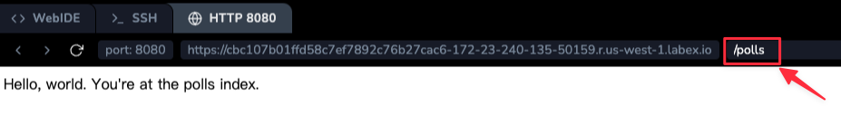

# Schreiben Ihrer ersten Ansicht

Schreiben wir die erste Ansicht. Öffnen Sie die Datei `polls/views.py` und fügen Sie den folgenden Python-Code hinzu:

```python
from django.http import HttpResponse


def index(request):
    return HttpResponse("Hello, world. You're at the polls index.")
```

Dies ist die einfachste Ansicht, die es in Django gibt. Um die Ansicht aufzurufen, müssen wir sie einer URL zuordnen – und dazu brauchen wir eine URL-Konfiguration (URLconf).

Um eine URLconf im `polls`-Verzeichnis zu erstellen, erstellen Sie eine Datei namens `urls.py`. Ihr App-Verzeichnis sollte jetzt so aussehen:

```plaintext
polls/
    __init__.py
    admin.py
    apps.py
    migrations/
        __init__.py
    models.py
    tests.py
    urls.py
    views.py
```

Fügen Sie im File `polls/urls.py` folgenden Code hinzu:

```python
from django.urls import path

from. import views

urlpatterns = [
    path("", views.index, name="index"),
]
```

Der nächste Schritt besteht darin, die Wurzel-URLconf auf das Modul `polls.urls` zu verweisen. In `mysite/urls.py` fügen Sie einen Import für `django.urls.include` hinzu und fügen Sie ein `~django.urls.include` in die `urlpatterns`-Liste ein, so dass Sie haben:

```python
from django.contrib import admin
from django.urls import include, path

urlpatterns = [
    path("polls/", include("polls.urls")),
    path("admin/", admin.site.urls),
]
```

Die Funktion `~django.urls.include` ermöglicht das Verweisen auf andere URLconfs. Wenn Django `~django.urls.include` findet, schneidet es den Teil der URL ab, der bis zu diesem Punkt übereinstimmt, und sendet den verbleibenden String an die eingeschlossene URLconf für weitere Verarbeitung.

Das Konzept hinter `~django.urls.include` ist es, das Einbinden und Spielen von URLs einfach zu machen. Da die Umfragen in ihrer eigenen URLconf (`polls/urls.py`) liegen, können sie unter "/polls/", oder unter "/fun_polls/", oder unter "/content/polls/" oder unter jedem anderen Pfadwurzel platziert werden, und die App wird weiterhin funktionieren.

> Wann sollte man `~django.urls.include()` verwenden?
> Sie sollten immer `include()` verwenden, wenn Sie andere URL-Muster einbetten. `admin.site.urls` ist die einzige Ausnahme hiervon.

Sie haben jetzt eine `index`-Ansicht in die URLconf eingefügt. Vergewissern Sie sich, dass es funktioniert, mit dem folgenden Befehl:

```bash
python manage.py runserver 0.0.0.0:8080
```

Gehen Sie in Ihrem Browser zu <http://<url>/polls/> und Sie sollten den Text "_Hello, world. You're at the polls index._" sehen, den Sie in der `index`-Ansicht definiert haben.



Die Funktion `~django.urls.path` wird vier Argumente übergeben, zwei erforderlich: `route` und `view`, und zwei optional: `kwargs` und `name`. An dieser Stelle lohnt es sich, sich noch einmal zu überlegen, wofür diese Argumente eingesetzt werden.

## `~django.urls.path`-Argument: `route`

`route` ist ein String, der ein URL-Muster enthält. Wenn Django eine Anfrage verarbeitet, startet es mit dem ersten Muster in `urlpatterns` und geht die Liste entlang, vergleicht die angeforderte URL mit jedem Muster, bis es eines findet, das übereinstimmt.

Muster durchsuchen nicht GET- und POST-Parameter oder den Domainnamen. Beispielsweise sucht die URLconf in einer Anfrage an `https://www.example.com/myapp/` nach `myapp/`. In einer Anfrage an `https://www.example.com/myapp/?page=3` sucht die URLconf ebenfalls nach `myapp/`.

## `~django.urls.path`-Argument: `view`

Wenn Django ein passendes Muster findet, ruft es die angegebene Ansichtsfunktion mit einem `~django.http.HttpRequest`-Objekt als erstes Argument und allen "eingefangenen" Werten aus der Route als Schlüsselwortargumente auf. Wir werden ein Beispiel dafür gleich geben.

## `~django.urls.path`-Argument: `kwargs`

Beliebige Schlüsselwortargumente können in einem Dictionary an die Zielansicht übergeben werden. Wir werden diese Funktion von Django in diesem Tutorial nicht verwenden.

## `~django.urls.path`-Argument: `name`

Das Benennen Ihrer URL ermöglicht es Ihnen, auf sie eindeutig von anderen Teilen von Django aus zu verweisen, insbesondere aus innerhalb von Templates. Diese leistungsstarke Funktion ermöglicht es Ihnen, globale Änderungen an den URL-Mustern Ihres Projekts vorzunehmen, indem Sie nur eine einzige Datei berühren.
