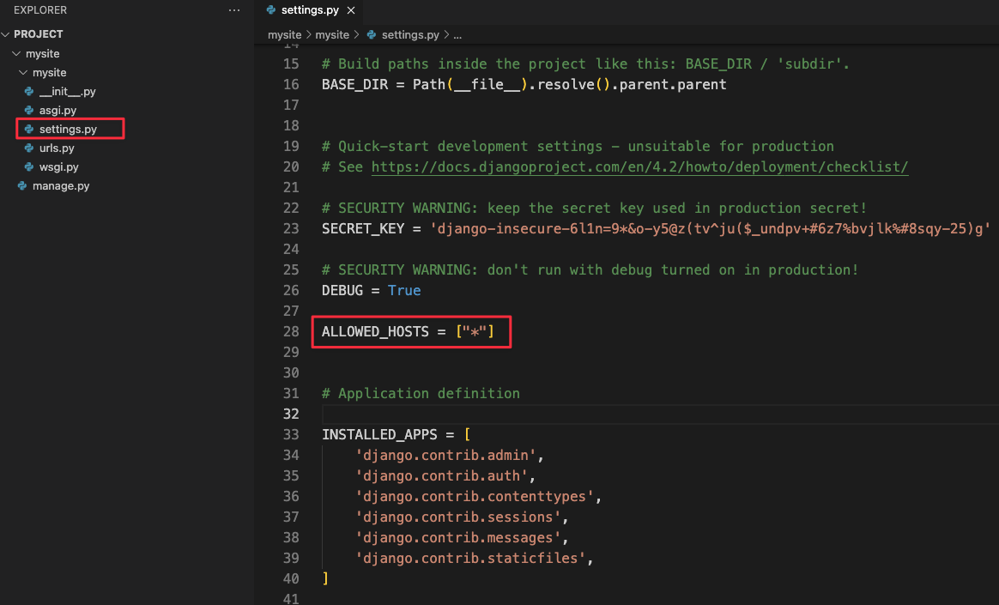
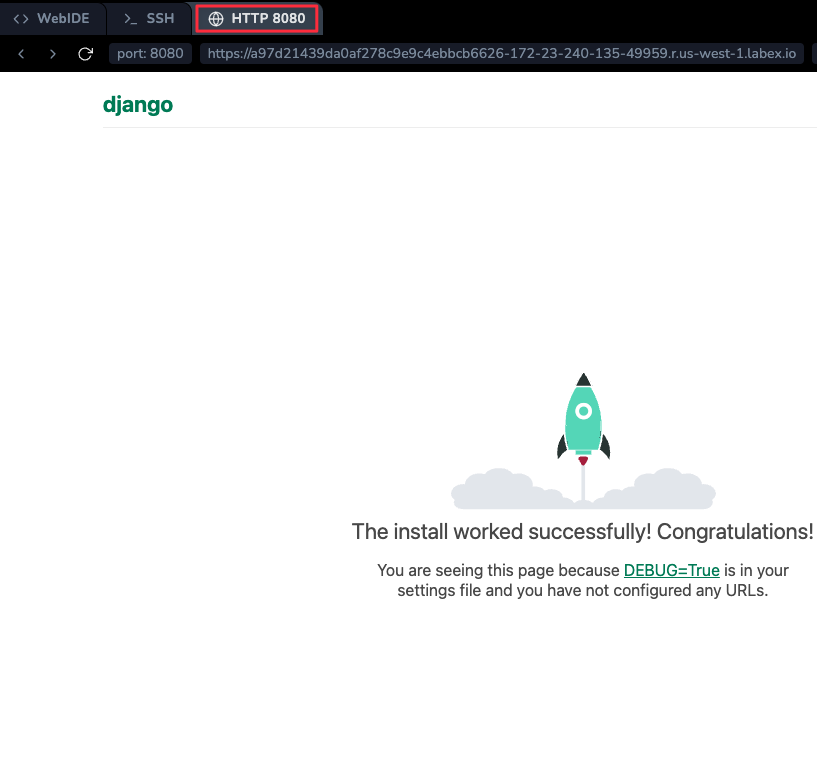

# 개발 서버

Django 프로젝트가 작동하는지 확인해 보겠습니다. 아직 하지 않았다면 외부 `mysite` 디렉토리로 이동하여 다음 명령을 실행합니다.

```bash
cd ~/project/mysite
python manage.py runserver
```

명령줄에 다음 출력이 표시됩니다.

```plaintext
Performing system checks...

System check identified no issues (0 silenced).

You have unapplied migrations; your app may not work properly until they are applied. Run 'python manage.py migrate' to apply them.

- 15:50:53 Django version , using settings 'mysite.settings' Starting development server at <http://127.0.0.1:8000/> Quit the server with CONTROL-C.
```

지금은 적용되지 않은 데이터베이스 마이그레이션에 대한 경고를 무시하십시오. 곧 데이터베이스를 처리할 것입니다.

Django 개발 서버, 즉 순수하게 Python 으로 작성된 경량 웹 서버를 시작했습니다. 프로덕션 환경에 준비될 때까지 Apache 와 같은 프로덕션 서버를 구성할 필요 없이 빠르게 개발할 수 있도록 Django 에 포함시켰습니다.

이제 다음 사항을 기억하는 것이 좋습니다. **프로덕션** 환경과 유사한 환경에서는 이 서버를 사용하지 **마십시오**. 개발 중에만 사용하도록 설계되었습니다. (저희는 웹 프레임워크를 만드는 일을 하고 있으며, 웹 서버를 만드는 일은 아닙니다.)

이제 서버가 실행 중이므로 웹 브라우저로 <http://127.0.0.1:8000/>을 방문하십시오. 또는 터미널에서 `curl 127.0.0.1:8000`을 실행하십시오. 로켓이 이륙하는 "축하합니다!" 페이지가 표시됩니다. 작동했습니다!

LabEx VM 에서는 `ALLOWED_HOSTS`에 LabEx 도메인을 추가해야 합니다. `mysite/settings.py`를 편집하고 `ALLOWED_HOSTS`의 끝에 `*`를 추가하여 다음과 같이 보이도록 합니다.

```python
ALLOWED_HOSTS = ["*"]
```

이렇게 하면 Django 가 모든 호스트 헤더로 요청을 제공할 수 있음을 알립니다.



## 포트 변경

기본적으로 `runserver` 명령은 포트 8000 의 내부 IP 에서 개발 서버를 시작합니다.

서버의 포트를 변경하려면 명령줄 인수로 전달하십시오. 예를 들어, 이 명령은 포트 8080 에서 서버를 시작합니다.

```bash
python manage.py runserver 8080
```

서버의 IP 를 변경하려면 포트와 함께 전달하십시오. 예를 들어, 사용 가능한 모든 공용 IP 를 수신 대기하려면 (Vagrant 를 실행하거나 네트워크의 다른 컴퓨터에서 작업을 표시하려는 경우 유용함) 다음을 사용하십시오.

```bash
python manage.py runserver 0.0.0.0:8080
```

이제 LabEx VM 에서 **Web 8080** 탭으로 전환하면 동일한 "축하합니다" 페이지가 표시됩니다.



개발 서버에 대한 전체 문서는 `runserver` 참조에서 찾을 수 있습니다.

> `runserver`의 자동 재로딩
> 개발 서버는 필요에 따라 각 요청에 대해 Python 코드를 자동으로 다시 로드합니다. 코드 변경 사항이 적용되도록 서버를 다시 시작할 필요가 없습니다. 그러나 파일을 추가하는 것과 같은 일부 작업은 다시 시작을 트리거하지 않으므로 이러한 경우 서버를 다시 시작해야 합니다.
