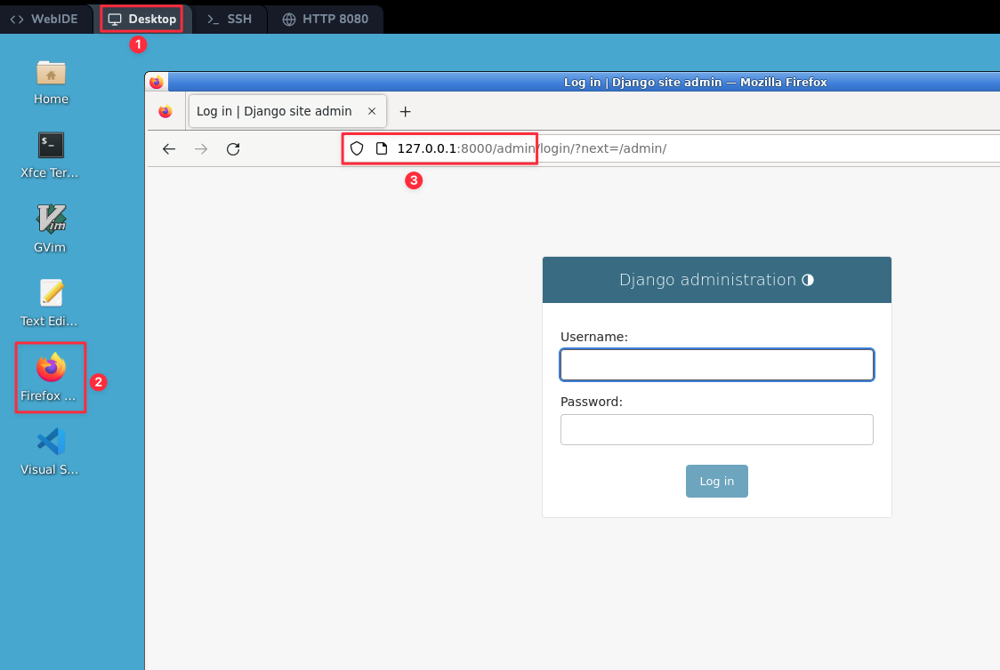

# 介绍 Django 管理界面

为员工或客户生成用于添加、更改和删除内容的管理站点是一项繁琐的工作，不需要太多创造力。因此，Django 完全自动化了模型管理界面的创建。

Django 是在新闻编辑室环境中编写的，“内容发布者”和“公共”站点之间有非常明确的分隔。站点管理员使用该系统添加新闻报道、活动、体育比分等，这些内容会显示在公共站点上。Django 解决了为站点管理员创建统一界面来编辑内容的问题。

管理界面不是供站点访问者使用的。它是为站点管理员准备的。

## 创建一个管理用户

首先，我们需要创建一个可以登录到管理站点的用户。运行以下命令：

```bash
python manage.py createsuperuser
```

输入你想要的用户名，然后按回车键。

```plaintext
用户名：admin
```

然后系统会提示你输入想要的电子邮件地址：

```plaintext
电子邮件地址：admin@example.com
```

最后一步是输入你的密码。系统会要求你输入两次密码，第二次是对第一次的确认。

```plaintext
密码：12345678
再次输入密码：12345678

此密码太常见。
此密码全是数字。
无论如何都要绕过密码验证并创建用户吗？[y/N]：y
超级用户创建成功。
```

## 启动开发服务器

Django 管理站点默认是激活的。让我们启动开发服务器并进行探索。

如果服务器没有运行，像这样启动它：

```bash
python manage.py runserver
```

现在，在**VNC**标签中打开一个网页浏览器，然后在你的本地域名上访问“/admin/” —— 例如，`http://127.0.0.1:8000/admin/`。你应该会看到管理界面的登录屏幕：



由于默认情况下启用了 `翻译 </topics/i18n/translation>`，如果你设置了 `LANGUAGE_CODE`，登录屏幕将以指定的语言显示（前提是 Django 有相应的翻译）。

## 进入管理站点

现在，尝试使用你在上一步中创建的超级用户账户登录。你应该会看到 Django 管理界面的首页：


你应该会看到几种可编辑的内容类型：组和用户。它们由 Django 附带的认证框架 `django.contrib.auth` 提供。

## 让投票应用在管理界面中可修改

但是我们的投票应用在哪里呢？它没有显示在管理界面的首页上。

只需要再做一件事：我们需要告诉管理界面 `Question` 对象有一个管理界面。要做到这一点，打开 `polls/admin.py` 文件，并将其编辑成如下所示：

```python
from django.contrib import admin

from.models import Question

admin.site.register(Question)
```

## 探索免费的管理功能

现在我们已经注册了 `Question`，Django 知道它应该显示在管理界面的首页上：


点击“问题”。现在你在问题的“更改列表”页面。这个页面显示了数据库中的所有问题，并让你选择一个进行更改。这里有我们之前创建的“What's up?”问题：


点击“What's up?”问题进行编辑：


这里需要注意的几点：

- 表单是根据 `Question` 模型自动生成的。
- 不同的模型字段类型（`~django.db.models.DateTimeField`，`~django.db.models.CharField`）对应相应的 HTML 输入小部件。每种字段类型都知道如何在 Django 管理界面中显示自己。
- 每个 `~django.db.models.DateTimeField` 都有免费的 JavaScript 快捷方式。日期有一个“今天”快捷方式和日历弹出窗口，时间有一个“现在”快捷方式和一个列出常用输入时间的方便弹出窗口。

页面底部为你提供了几个选项：

- 保存 —— 保存更改并返回此类型对象的更改列表页面。
- 保存并继续编辑 —— 保存更改并重新加载此对象的管理页面。
- 保存并添加另一个 —— 保存更改并加载此类型对象的新的空白表单。
- 删除 —— 显示删除确认页面。

如果“发布日期”的值与你在**创建基本投票应用**中创建问题时的时间不匹配，可能意味着你忘记为 `TIME_ZONE` 设置正确的值。更改它，重新加载页面并检查是否显示了正确的值。

通过点击“今天”和“现在”快捷方式更改“发布日期”。然后点击“保存并继续编辑”。然后点击右上角的“历史记录”。你会看到一个页面，列出了通过 Django 管理界面对此对象所做的所有更改，以及进行更改的人的时间戳和用户名：


当你熟悉了模型 API 并熟悉了管理站点后，请阅读**创建公共接口视图**，以了解如何为我们的投票应用添加更多视图。
