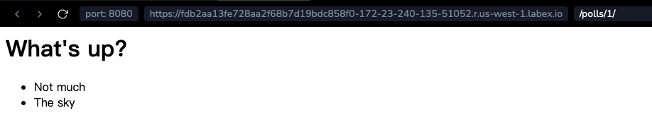

# Namensraum für URL-Namen

Das Tutorial-Projekt hat nur eine App, nämlich `polls`. In echten Django-Projekten könnten es fünf, zehn, zwanzig Apps oder mehr geben. Wie unterscheidet Django die URL-Namen zwischen ihnen? Beispielsweise hat die `polls`-App eine `detail`-Ansicht, und auch eine App auf dem gleichen Projekt, die für einen Blog ist, könnte dies tun. Wie kann man dafür sorgen, dass Django weiß, welche App-Ansicht für eine URL zu erstellen, wenn man das ``-Template-Tag verwendet?

Die Antwort ist, Namensräume zu Ihrem URLconf hinzuzufügen. Öffnen Sie die Datei `polls/urls.py` und fügen Sie einen `app_name` hinzu, um den Anwendungs-Namensraum festzulegen:

```python
from django.urls import path

from. import views

app_name = "polls"
urlpatterns = [
    # z.B.: /polls/
    path("", views.index, name="index"),
    # z.B.: /polls/5/
    path("<int:question_id>/", views.detail, name="detail"),
    # z.B.: /polls/5/results/
    path("<int:question_id>/results/", views.results, name="results"),
    # z.B.: /polls/5/vote/
    path("<int:question_id>/vote/", views.vote, name="vote"),
]
```

Ändern Sie nun Ihr `polls/index.html`-Template von:

```html+django
<li><a href="">{{ question.question_text }}</a></li>
```

um auf die Namensraum-detail-Ansicht zu verweisen:

```html+django
<li><a href="">{{ question.question_text }}</a></li>
```



Wenn Sie sich mit dem Schreiben von Ansichten vertraut machen, lesen Sie **Form Processing and Cutting Down Our Code**, um die Grundlagen der Formularverarbeitung und generischer Ansichten zu lernen.
