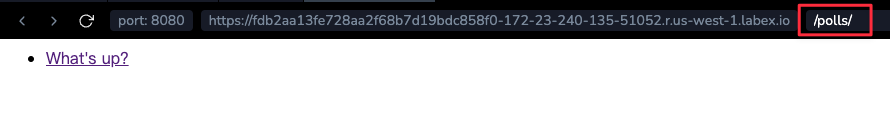

# 実際に何かを行うビューを作成する

各ビューは、2つのことのいずれかを行う責任があります。要求されたページのコンテンツを含む `~django.http.HttpResponse` オブジェクトを返すこと、または `~django.http.Http404` などの例外を発生させることです。それ以外はあなた次第です。

あなたのビューはデータベースからレコードを読み取ってもよいし、読み取らなくてもよいです。Djangoのようなテンプレートシステムを使ってもよいし、サードパーティのPythonテンプレートシステムを使ってもよいし、使わなくてもよいです。PDFファイルを生成したり、XMLを出力したり、オンザフライでZIPファイルを作成したり、あなたが望むことは何でも、あなたが望むPythonライブラリを使って行うことができます。

Djangoが望むのは、その `~django.http.HttpResponse` だけです。または例外です。

便利なので、チュートリアル2で扱ったDjango自身のデータベースAPIを使いましょう。ここに新しい `index()` ビューの試しです。このビューは、公開日付に基づいて、システム内の最新の5つの投票質問をコンマ区切りで表示します。

`polls/views.py` ファイルを編集して、次のように変更します。

```python
from django.http import HttpResponse

from.models import Question


def index(request):
    latest_question_list = Question.objects.order_by("-pub_date")[:5]
    output = ", ".join([q.question_text for q in latest_question_list])
    return HttpResponse(output)


# Leave the rest of the views (detail, results, vote) unchanged
```

ただし、ここに問題があります。ページのデザインがビューにハードコードされています。ページの見た目を変更したい場合、このPythonコードを編集する必要があります。ですから、Djangoのテンプレートシステムを使って、デザインをPythonから分離しましょう。ビューが使用できるテンプレートを作成します。

まず、`polls` ディレクトリに `templates` という名前のディレクトリを作成します。Djangoはそこにあるテンプレートを探します。

あなたのプロジェクトの `TEMPLATES` 設定は、Djangoがテンプレートを読み込み、レンダリングする方法を記述しています。デフォルトの設定ファイルは、`APP_DIRS <TEMPLATES-APP_DIRS>` オプションが `True` に設定された `DjangoTemplates` バックエンドを構成しています。慣例として、`DjangoTemplates` は各 `INSTALLED_APPS` 内の "templates" サブディレクトリを探します。

先ほど作成した `templates` ディレクトリ内に、さらに `polls` という名前のディレクトリを作成し、その中に `index.html` という名前のファイルを作成します。つまり、あなたのテンプレートは `polls/templates/polls/index.html` にあるはずです。上記の `app_directories` テンプレートローダーの動作方法のため、Django内でこのテンプレートを `polls/index.html` として参照できます。

## テンプレートの名前空間化

今、私たちはテンプレートを直接 `polls/templates` に置くことができるかもしれません（別の `polls` サブディレクトリを作成する代わりに）が、実際には悪い考えです。Djangoは名前が一致する最初のテンプレートを選びます。もし異なるアプリケーションに同じ名前のテンプレートがあった場合、Djangoはそれらを区別できません。

私たちはDjangoに正しいものを指すことができるようにする必要があり、これを確実にする最良の方法は、それらを _名前空間化_ することです。つまり、それらのテンプレートをアプリケーション自体に名付けられた _別の_ ディレクトリの中に置くことです。

そのテンプレートに次のコードを入れます。

```html+django

    <ul>
    
        <li><a href="/polls/{{ question.id }}/">{{ question.question_text }}</a></li>
    
    </ul>

    <p>No polls are available.</p>

```

注:

チュートリアルを短くするため、すべてのテンプレートの例は不完全なHTMLを使用しています。あなた自身のプロジェクトでは、[完全なHTMLドキュメント](https://developer.mozilla.org/en-US/docs/Learn/HTML/Introduction_to_HTML/Getting_started#anatomy_of_an_html_document) を使用する必要があります。

では、`polls/views.py` の `index` ビューを更新して、テンプレートを使用するようにしましょう。

```python
from django.http import HttpResponse
from django.template import loader

from.models import Question


def index(request):
    latest_question_list = Question.objects.order_by("-pub_date")[:5]
    template = loader.get_template("polls/index.html")
    context = {
        "latest_question_list": latest_question_list,
    }
    return HttpResponse(template.render(context, request))
```

そのコードは `polls/index.html` という名前のテンプレートを読み込み、コンテキストを渡します。コンテキストは、テンプレート変数名をPythonオブジェクトにマッピングする辞書です。

再度サーバーを起動します。

```bash
python manage.py runserver 0.0.0.0:8080
```

ブラウザで "/polls/" にアクセスしてページを読み込むと、チュートリアル2の "What's up" の質問が含まれる箇条書きリストが表示されるはずです。リンクは質問の詳細ページを指しています。



## ショートカット: `~django.shortcuts.render`

テンプレートを読み込み、コンテキストを埋め、レンダリングされたテンプレートの結果を含む `~django.http.HttpResponse` オブジェクトを返すのは、非常に一般的な慣用句です。Djangoはショートカットを提供しています。以下は、書き直された完全な `index()` ビューです。

```python
from django.shortcuts import render

from.models import Question


def index(request):
    latest_question_list = Question.objects.order_by("-pub_date")[:5]
    context = {"latest_question_list": latest_question_list}
    return render(request, "polls/index.html", context)
```

これをすべてのビューで行った後、`~django.template.loader` と `~django.http.HttpResponse` をインポートする必要はもうありません（`detail`、`results`、`vote` のスタブメソッドがまだある場合は、`HttpResponse` を残しておく必要があります）。

`~django.shortcuts.render` 関数は、最初の引数に要求オブジェクト、2番目の引数にテンプレート名、オプションの3番目の引数に辞書を取ります。与えられたコンテキストでレンダリングされた与えられたテンプレートの `~django.http.HttpResponse` オブジェクトを返します。
