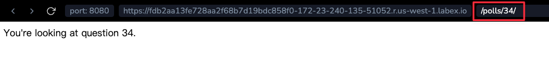

# 编写更多视图

现在让我们在 `polls/views.py` 中添加更多视图。这些视图略有不同，因为它们接受一个参数：

```python
def detail(request, question_id):
    return HttpResponse("You're looking at question %s." % question_id)


def results(request, question_id):
    response = "You're looking at the results of question %s."
    return HttpResponse(response % question_id)


def vote(request, question_id):
    return HttpResponse("You're voting on question %s." % question_id)
```

通过添加以下 `~django.urls.path` 调用，将这些新视图连接到 `polls.urls` 模块：

编辑 `polls/urls.py` 文件并添加以下行：

```python
from django.urls import path

from. import views

urlpatterns = [
    # 例如：/polls/
    path("", views.index, name="index"),
    # 例如：/polls/5/
    path("<int:question_id>/", views.detail, name="detail"),
    # 例如：/polls/5/results/
    path("<int:question_id>/results/", views.results, name="results"),
    # 例如：/polls/5/vote/
    path("<int:question_id>/vote/", views.vote, name="vote"),
]
```

现在，再次运行服务器：

```bash
cd ~/project/mysite
python manage.py runserver 0.0.0.0:8080
```

切换到 **Web 8080** 标签页，访问 `/polls/34/`。它将运行 `detail()` 方法并显示你在 URL 中提供的任何 ID。也试试 `/polls/34/results/` 和 `/polls/34/vote/` —— 这些将显示占位符结果和投票页面。



当有人从你的网站请求一个页面时 —— 比如说，`/polls/34/`，Django 将加载 `mysite.urls` Python 模块，因为它由 `ROOT_URLCONF` 设置指向。它找到名为 `urlpatterns` 的变量并按顺序遍历这些模式。在 `'polls/'` 处找到匹配项后，它去掉匹配的文本 (`"polls/"`) 并将剩余的文本 ——`"34/"` —— 发送到 `polls.urls` URL 配置进行进一步处理。在那里它匹配 `'<int:question_id>/'`，从而调用 `detail()` 视图，如下所示：

```python
detail(request=<HttpRequest对象>, question_id=34)
```

`question_id=34` 部分来自 `<int:question_id>`。使用尖括号“捕获”URL 的一部分，并将其作为关键字参数发送到视图函数。字符串中的 `question_id` 部分定义了用于标识匹配模式的名称，而 `int` 部分是一个转换器，它确定哪些模式应该与 URL 路径的这一部分匹配。冒号 (`:`) 分隔转换器和模式名称。
