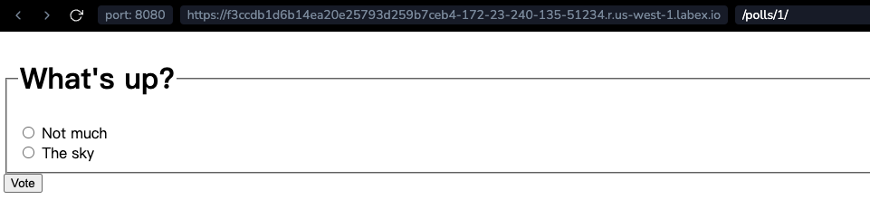

# Écrire un formulaire minimal

Mettons à jour notre modèle de détail de sondage (`polls/detail.html`) du dernier tutoriel, de sorte que le modèle contienne un élément HTML `<form>` :

```html+django
<form action="" method="post">

<fieldset>
    <legend><h1>{{ question.question_text }}</h1></legend>
    <p><strong>{{ error_message }}</strong></p>
    
        <input type="radio" name="choice" id="choice{{ forloop.counter }}" value="{{ choice.id }}">
        <label for="choice{{ forloop.counter }}">{{ choice.choice_text }}</label><br>
    
</fieldset>
<input type="submit" value="Vote">
</form>
```

Un rapide survol :

- Le modèle ci-dessus affiche un bouton radio pour chaque choix de question. La `valeur` de chaque bouton radio est l'ID associé au choix de question. Le `nom` de chaque bouton radio est `"choice"`. Cela signifie que, lorsqu'un utilisateur sélectionne un des boutons radio et soumet le formulaire, il enverra les données POST `choice=#` où \# est l'ID du choix sélectionné. Voilà le concept de base des formulaires HTML.
- Nous avons défini l'`action` du formulaire sur ``, et nous avons défini `méthode="post"`. Utiliser `méthode="post"` (au lieu de `méthode="get"`) est très important, car l'acte de soumettre ce formulaire modifiera les données côté serveur. Chaque fois que vous créez un formulaire qui modifie les données côté serveur, utilisez `méthode="post"`. Ce conseil n'est pas spécifique à Django ; c'est une bonne pratique de développement web en général.
- `forloop.counter` indique combien de fois la balise `for` a parcouru sa boucle
- Puisque nous créons un formulaire POST (qui peut avoir pour effet de modifier les données), nous devons nous soucier des falsifications de requêtes entre sites. Heureusement, vous n'avez pas à vous inquiéter trop, car Django dispose d'un système utile pour se prémunir contre cela. En bref, tous les formulaires POST visant des URL internes devraient utiliser la balise de modèle `<csrf_token>`.

Maintenant, créons une vue Django qui gère les données soumises et en fait quelque chose. Rappelez-vous, dans `**Creating the Public Interface Views**`, nous avons créé une configuration d'URL pour l'application de sondages qui contient cette ligne :

```python
path("<int:question_id>/vote/", views.vote, name="vote"),
```

Nous avons également créé une implémentation fictive de la fonction `vote()`. Créons une version réelle. Ajoutez ce qui suit à `polls/views.py` :

```python
from django.http import HttpResponse, HttpResponseRedirect
from django.shortcuts import get_object_or_404, render
from django.urls import reverse

from.models import Choice, Question


#...
def vote(request, question_id):
    question = get_object_or_404(Question, pk=question_id)
    try:
        selected_choice = question.choice_set.get(pk=request.POST["choice"])
    except (KeyError, Choice.DoesNotExist):
        # Redisplay the question voting form.
        return render(
            request,
            "polls/detail.html",
            {
                "question": question,
                "error_message": "You didn't select a choice.",
            },
        )
    else:
        selected_choice.votes += 1
        selected_choice.save()
        # Always return an HttpResponseRedirect after successfully dealing
        # with POST data. This prevents data from being posted twice if a
        # user hits the Back button.
        return HttpResponseRedirect(reverse("polls:results", args=(question.id,)))
```

Ce code inclut quelques éléments que nous n'avons pas encore abordés dans ce tutoriel :

- `request.POST <django.http.HttpRequest.POST>` est un objet ressemblant à un dictionnaire qui vous permet d'accéder aux données soumises par nom de clé. Dans ce cas, `request.POST['choice']` renvoie l'ID du choix sélectionné, sous forme de chaîne de caractères. Les valeurs de `request.POST <django.http.HttpRequest.POST>` sont toujours des chaînes de caractères.

  Notez que Django fournit également `request.GET
<django.http.HttpRequest.GET>` pour accéder aux données GET de la même manière - mais nous utilisons explicitement `request.POST
<django.http.HttpRequest.POST>` dans notre code, pour vous assurer que les données ne sont modifiées que via un appel POST.

- `request.POST['choice']` lèvera une `KeyError` si `choice` n'est pas fourni dans les données POST. Le code ci-dessus vérifie la `KeyError` et redisplaye le formulaire de question avec un message d'erreur si `choice` n'est pas donné.

- Après avoir incrémenté le compteur de choix, le code renvoie une `~django.http.HttpResponseRedirect` plutôt qu'une `~django.http.HttpResponse` normale. `~django.http.HttpResponseRedirect` prend un seul argument : l'URL vers laquelle l'utilisateur sera redirigé (voir le point suivant pour savoir comment nous construisons l'URL dans ce cas).

  Comme le commentaire Python ci-dessus le souligne, vous devriez toujours renvoyer une `~django.http.HttpResponseRedirect` après avoir correctement traité les données POST. Ce conseil n'est pas spécifique à Django ; c'est une bonne pratique de développement web en général.

- Nous utilisons la fonction `~django.urls.reverse` dans le constructeur `~django.http.HttpResponseRedirect` dans cet exemple. Cette fonction aide à éviter d'avoir à coder en dur une URL dans la fonction de vue. Elle est donnée le nom de la vue vers laquelle nous voulons passer le contrôle et la partie variable du motif d'URL qui pointe vers cette vue. Dans ce cas, en utilisant la configuration d'URL que nous avons établie dans `**Creating the Public Interface Views**`, cet appel `~django.urls.reverse` renverra une chaîne de caractères comme :

      "/polls/3/results/"

  où le `3` est la valeur de `question.id`. Cette URL redirigée appellera ensuite la vue `'results'` pour afficher la page finale.

Comme mentionné dans `**Creating the Public Interface Views**`, `request` est un objet `~django.http.HttpRequest`. Pour en savoir plus sur les objets `~django.http.HttpRequest`, consultez la `documentation sur les requêtes et les réponses </ref/request-response>`.

Après qu'un utilisateur ait voté pour une question, la vue `vote()` redirige vers la page des résultats de la question. Écrivons cette vue :

```python
from django.shortcuts import get_object_or_404, render


def results(request, question_id):
    question = get_object_or_404(Question, pk=question_id)
    return render(request, "polls/results.html", {"question": question})
```

Cela est presque exactement le même que la vue `detail()` de **Creating the Public Interface Views**. La seule différence est le nom du modèle. Nous corrigerons cette redondance plus tard.

Maintenant, créez un modèle `polls/results.html` :

```html+django
<h1>{{ question.question_text }}</h1>

<ul>

    <li>{{ choice.choice_text }} -- {{ choice.votes }} vote{{ choice.votes|pluralize }}</li>

</ul>

<a href="">Vote again?</a>
```

Maintenant, accédez à `/polls/1/` dans votre navigateur et votez pour la question. Vous devriez voir une page de résultats qui se met à jour chaque fois que vous votez. Si vous soumettez le formulaire sans avoir choisi de choix, vous devriez voir le message d'erreur.

```bash
cd ~/project/mysite
python manage.py runserver 0.0.0.0:8080
```



**Remarque :**

Le code de notre vue `vote()` a un petit problème. Il obtient d'abord l'objet `selected_choice` de la base de données, puis calcule la nouvelle valeur de `votes`, puis la sauvegarde dans la base de données. Si deux utilisateurs de votre site tentent de voter _exactement en même temps_, cela peut se mal passer : La même valeur, disons 42, sera récupérée pour `votes`. Ensuite, pour les deux utilisateurs, la nouvelle valeur de 43 est calculée et enregistrée, mais 44 serait la valeur attendue.

Cela s'appelle une _condition de course_. Si vous êtes intéressé, vous pouvez lire `avoiding-race-conditions-using-f` pour apprendre comment résoudre ce problème.
