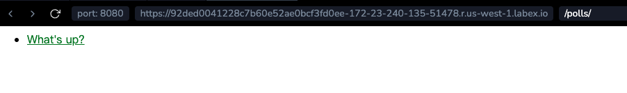

# アプリケーションの見た目をカスタマイズする

まず、`polls` ディレクトリ内に `static` という名前のディレクトリを作成します。Django はここに静的ファイルを探します。これは、Django が `polls/templates/` 内のテンプレートを見つける方法と同様です。

Django の `STATICFILES_FINDERS` 設定には、さまざまなソースから静的ファイルを見つける方法を知っているファインダーのリストが含まれています。デフォルトの 1 つは `AppDirectoriesFinder` で、これは各 `INSTALLED_APPS` 内の "static" サブディレクトリを探します。これは、私たちが作成したばかりの `polls` 内のもののようなものです。管理サイトも同じディレクトリ構造を静的ファイルに使用しています。

先ほど作成した `static` ディレクトリ内に、もう 1 つの `polls` という名前のディレクトリを作成し、その中に `style.css` という名前のファイルを作成します。つまり、あなたのスタイルシートは `polls/static/polls/style.css` にあるはずです。`AppDirectoriesFinder` 静的ファイルファインダーの動作方法のため、Django ではこの静的ファイルを `polls/style.css` として参照できます。これは、テンプレートのパスを参照する方法と同様です。

## 静的ファイルの名前空間化

テンプレートと同じように、私たちは静的ファイルを直接 `polls/static` に置くことができるかもしれません（別の `polls` サブディレクトリを作成する代わりに）が、実際には悪い考えです。Django は、名前が一致する最初の静的ファイルを見つけます。もし、別のアプリケーションに同じ名前の静的ファイルがあった場合、Django はそれらを区別することができません。私たちは Django に正しいものを指すことができるようにする必要があり、これを確実にする最良の方法は、それらを名前空間化することです。つまり、それらの静的ファイルをアプリケーション自体に名付けられた別のディレクトリの中に置くことです。

そのスタイルシート (`polls/static/polls/style.css`) に次のコードを入れます：

```css
li a {
  color: green;
}
```

次に、`polls/templates/polls/index.html` の先頭に次のコードを追加します：

```html+django


<link rel="stylesheet" href="">
```

`` テンプレートタグは、静的ファイルの絶対 URL を生成します。

開発に必要なことはこれだけです。

サーバーを起動します（既に実行中の場合は再起動します）：

```bash
python manage.py runserver 0.0.0.0:8080
```

**Web 8080** タブを再読み込みすると、質問のリンクが緑色になっているはずです（Django スタイル！）。これは、あなたのスタイルシートが正常に読み込まれたことを意味します。


