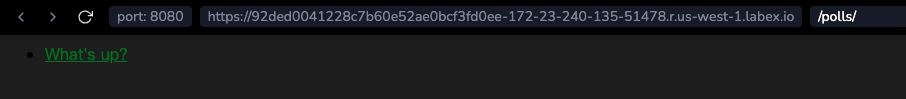

# Добавление фонового изображения

Далее, мы создадим поддиректорию для изображений. Создайте поддиректорию `images` в директории `polls/static/polls/`. Внутри этой директории добавьте любое изображение, которое вы хотите использовать в качестве фона. В целях этого туториала мы используем файл с именем `background.png`, который можно найти в директории `/tmp/background.png` в виртуальной машине.

Необходимо скопировать `/tmp/background.png` в `polls/static/polls/images/background.png`.

Затем добавьте ссылку на ваше изображение в таблицу стилей (`polls/static/polls/style.css`):

```css
body {
  background: white url("images/background.png") no-repeat;
}
```

Перезагрузите вкладку **Web 8080** и вы должны увидеть, что фон загружен в верхнем левом углу экрана.



> Шаблонный тег `` недоступен для использования в статических файлах, которые не генерируются Django, таких как ваша таблица стилей. Вы должны всегда использовать **относительные пути** для связывания между собой ваших статических файлов, потому что тогда вы можете изменить `STATIC_URL` (используемый шаблонным тегом `static` для генерации его URL-адресов) без необходимости также изменять кучу путей в ваших статических файлах.

Вот **основы**. Для получения более подробной информации о настройках и других аспектах, включенных в фреймворк, см. `руководство по статическим файлам </howto/static-files/index>` и `справочник по staticfiles </ref/contrib/staticfiles>`. `Развертывание статических файлов </howto/static-files/deployment>` обсуждает, как использовать статические файлы на настоящем сервере.

Когда вы будете знакомы с статическими файлами, прочитайте раздел **Настройка административного сайта Django**, чтобы узнать, как настроить автоматически сгенерированный административный сайт Django.
