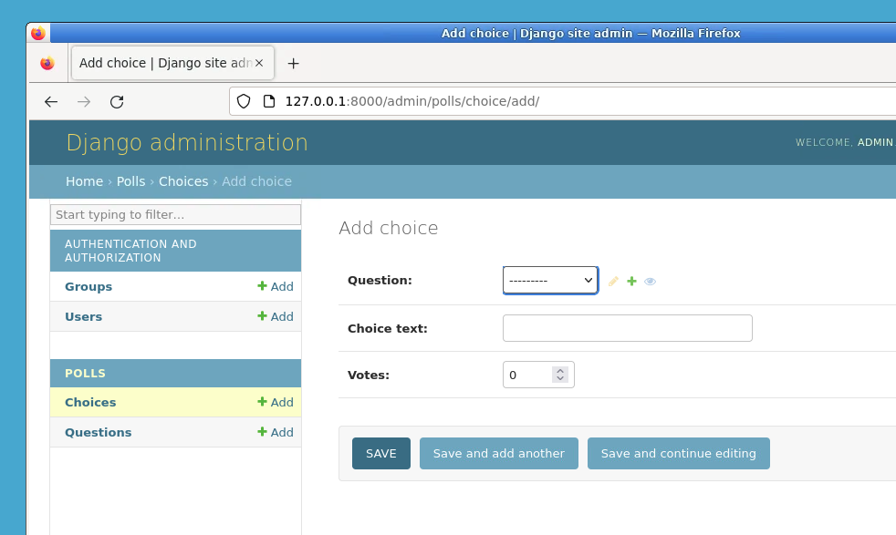
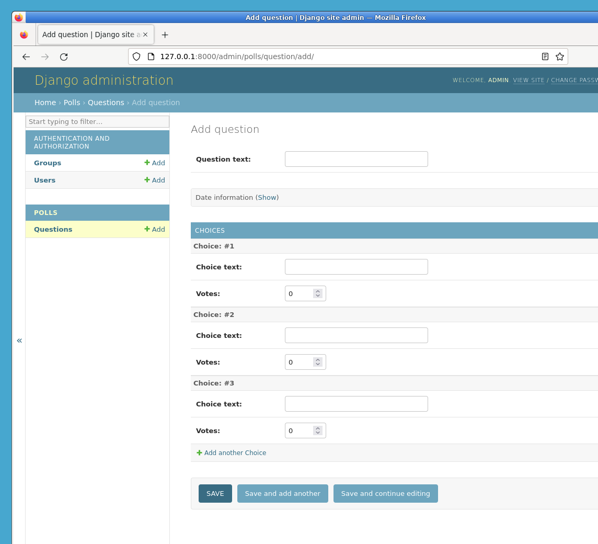
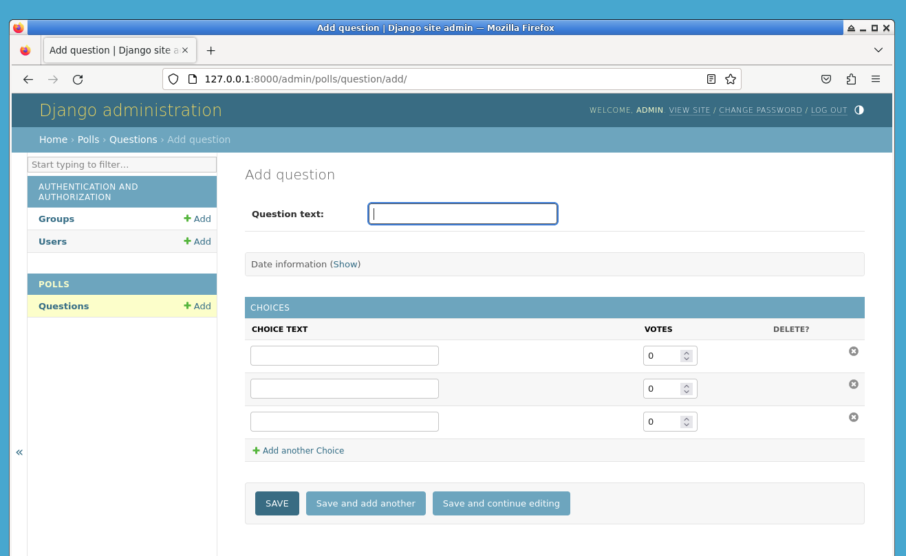

# Добавление связанных объектов

Хорошо, у нас есть страница администратора для вопросов, но `Question` имеет несколько `Choice`, и на странице администратора они не отображаются.

Ещё не отображаются.

Для решения этой проблемы есть два способа. Первый — это зарегистрировать `Choice` в административном интерфейсе так же, как мы регистрировали `Question`:

```python
from django.contrib import admin

from.models import Choice, Question

#...
admin.site.register(Choice)
```

Теперь "Choices" (Варианты ответов) доступен в административном интерфейсе Django. Форма "Добавить вариант ответа" выглядит так:



В этой форме поле "Question" (Вопрос) представляет собой выпадающий список, содержащий все вопросы из базы данных. Django знает, что `~django.db.models.ForeignKey` должен быть представлен в административном интерфейсе в виде `<select>` (выпадающего списка). В нашем случае на данный момент существует только один вопрос.

Обратите внимание на ссылку "Add another question" (Добавить другой вопрос) рядом с полем "Question". Каждый объект, имеющий отношение `ForeignKey` к другому объекту, получает такую ссылку бесплатно. Когда вы нажимаете на "Add another question", вы получите всплывающее окно с формой "Добавить вопрос". Если вы добавите вопрос в этом окне и нажмете "Save" (Сохранить), Django сохранит вопрос в базу данных и динамически добавит его в качестве выбранного варианта ответа на форме "Добавить вариант ответа", которую вы сейчас видите.

Но,说实话, это неэффективный способ добавления объектов `Choice` в систему. Было бы лучше, если бы вы могли добавить несколько вариантов ответов сразу при создании объекта `Question`. Давайте это реализуем.

Удалите вызов `register()` для модели `Choice`. Затем отредактируйте код регистрации `Question` так, чтобы он выглядел следующим образом:

```python
from django.contrib import admin

from.models import Choice, Question


class ChoiceInline(admin.StackedInline):
    model = Choice
    extra = 3


class QuestionAdmin(admin.ModelAdmin):
    fieldsets = [
        (None, {"fields": ["question_text"]}),
        ("Date information", {"fields": ["pub_date"], "classes": ["collapse"]}),
    ]
    inlines = [ChoiceInline]


admin.site.register(Question, QuestionAdmin)
```

Это говорит Django: "Объекты `Choice` редактируются на странице администратора для `Question`. По умолчанию предоставьте достаточно полей для 3 вариантов ответов."

Загрузите страницу "Добавить вопрос", чтобы посмотреть, как это выглядит:



Работает это так: есть три места для связанных вариантов ответов — как указано параметром `extra` — и каждый раз, когда вы возвращаетесь на страницу "Изменить" для уже созданного объекта, вы получаете ещё три дополнительных места.

В конце трёх текущих мест вы увидите ссылку "Add another Choice" (Добавить другой вариант ответа). Если вы нажмете на неё, будет добавлено новое место. Если вы хотите удалить добавленное место, вы можете нажать на крестик в правом верхнем углу добавленного места. На этом изображении показано добавленное место:


Одна небольшая проблема, однако. Для отображения всех полей для ввода связанных объектов `Choice` требуется много места на экране. По этой причине Django предлагает табличный способ отображения вложенных связанных объектов. Чтобы использовать его, измените объявление `ChoiceInline` так, чтобы оно выглядело следующим образом:

```python
class ChoiceInline(admin.TabularInline):
  ...
```

При использовании `TabularInline` (вместо `StackedInline`) связанные объекты отображаются в более компактном, табличном формате:



Обратите внимание, что есть дополнительный столбец "Delete?" (Удалить?), который позволяет удалить строки, добавленные с помощью кнопки "Add another Choice" (Добавить другой вариант ответа), а также строки, которые уже были сохранены.
