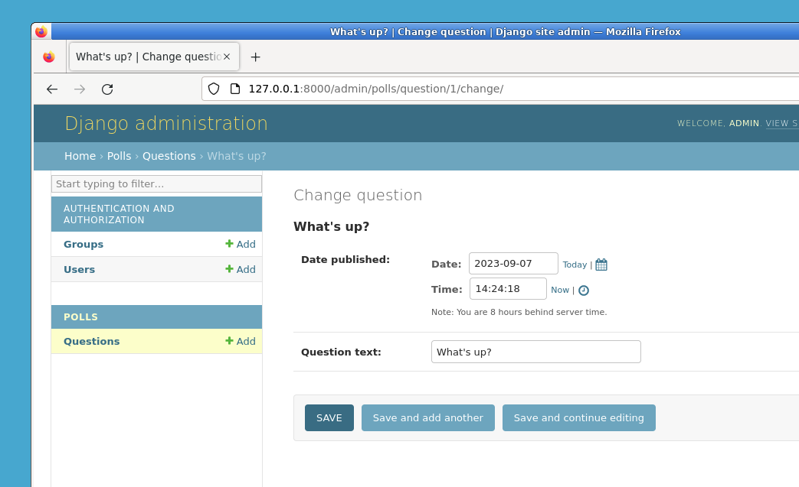

# Customize the admin form

By registering the `Question` model with `admin.site.register(Question)`, Django was able to construct a default form representation. Often, you'll want to customize how the admin form looks and works. You'll do this by telling Django the options you want when you register the object.

Let's see how this works by reordering the fields on the edit form. Replace the `admin.site.register(Question)` line with:

Edit the `~/project/mysite/polls/admin.py` file so it looks like this:

```python
from django.contrib import admin

from .models import Question


class QuestionAdmin(admin.ModelAdmin):
    fields = ["pub_date", "question_text"]


admin.site.register(Question, QuestionAdmin)
```

You'll follow this pattern -- create a model admin class, then pass it as the second argument to `admin.site.register()` -- any time you need to change the admin options for a model.

Run the Django development server:

```bash
cd ~/project/mysite
python manage.py runserver
```

Open `http://127.0.0.1:8000/admin/` in Firefox of Desktop Environment and click on the "Questions" link. You should see a form that looks like this.

This particular change above makes the "Publication date" come before the "Question" field:



This isn't impressive with only two fields, but for admin forms with dozens of fields, choosing an intuitive order is an important usability detail.

And speaking of forms with dozens of fields, you might want to split the form up into fieldsets:

```python
from django.contrib import admin

from .models import Question


class QuestionAdmin(admin.ModelAdmin):
    fieldsets = [
        (None, {"fields": ["question_text"]}),
        ("Date information", {"fields": ["pub_date"]}),
    ]


admin.site.register(Question, QuestionAdmin)
```

The first element of each tuple in `~django.contrib.admin.ModelAdmin.fieldsets` is the title of the fieldset. Here's what our form looks like now:


