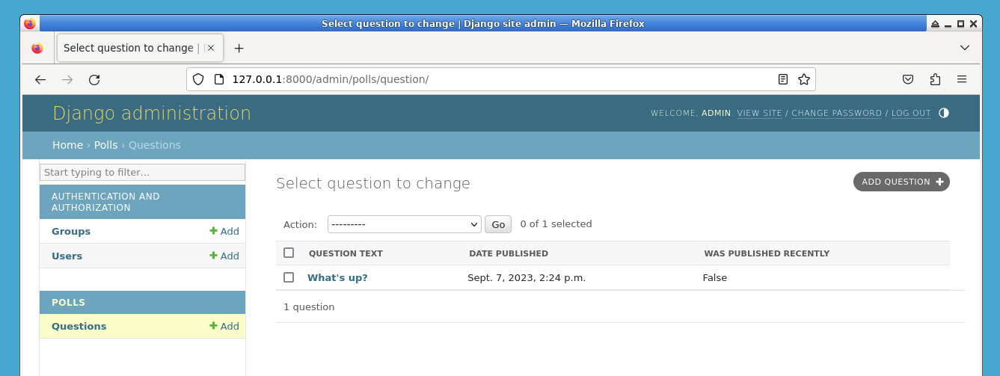
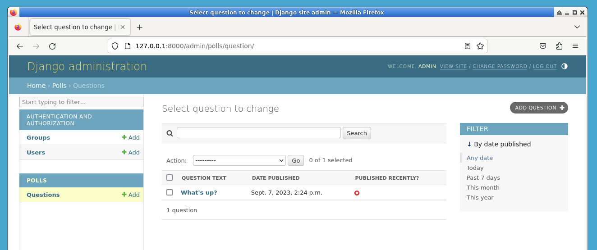

# Customize the admin change list

Now that the Question admin page is looking good, let's make some tweaks to the "change list" page -- the one that displays all the questions in the system.

Here's what it looks like at this point:


By default, Django displays the `str()` of each object. But sometimes it'd be more helpful if we could display individual fields. To do that, use the `~django.contrib.admin.ModelAdmin.list_display` admin option, which is a tuple of field names to display, as columns, on the change list page for the object:

```python
class QuestionAdmin(admin.ModelAdmin):
    # ...
    list_display = ["question_text", "pub_date"]
```

For good measure, let's also include the `was_published_recently()` method from `**Set Up the Database**`:

```python
class QuestionAdmin(admin.ModelAdmin):
    # ...
    list_display = ["question_text", "pub_date", "was_published_recently"]
```

Now the question change list page looks like this:



You can click on the column headers to sort by those values -- except in the case of the `was_published_recently` header, because sorting by the output of an arbitrary method is not supported. Also note that the column header for `was_published_recently` is, by default, the name of the method (with underscores replaced with spaces), and that each line contains the string representation of the output.

You can improve that by using the `~django.contrib.admin.display` decorator on that method (in `polls/models.py`), as follows:

```python
from django.contrib import admin


class Question(models.Model):
    # ...
    @admin.display(
        boolean=True,
        ordering="pub_date",
        description="Published recently?",
    )
    def was_published_recently(self):
        now = timezone.now()
        return now - datetime.timedelta(days=1) <= self.pub_date <= now
```

For more information on the properties configurable via the decorator, see `~django.contrib.admin.ModelAdmin.list_display`.

Edit your `polls/admin.py` file again and add an improvement to the `Question` change list page: filters using the `~django.contrib.admin.ModelAdmin.list_filter`. Add the following line to `QuestionAdmin`:

```python
list_filter = ["pub_date"]
```

That adds a "Filter" sidebar that lets people filter the change list by the `pub_date` field:



The type of filter displayed depends on the type of field you're filtering on. Because `pub_date` is a `~django.db.models.DateTimeField`, Django knows to give appropriate filter options: "Any date", "Today", "Past 7 days", "This month", "This year".

This is shaping up well. Let's add some search capability:

```python
search_fields = ["question_text"]
```

That adds a search box at the top of the change list. When somebody enters search terms, Django will search the `question_text` field. You can use as many fields as you'd like -- although because it uses a `LIKE` query behind the scenes, limiting the number of search fields to a reasonable number will make it easier for your database to do the search.

Now's also a good time to note that change lists give you free pagination. The default is to display 100 items per page. `Change list pagination
<django.contrib.admin.ModelAdmin.list_per_page>`, `search boxes
<django.contrib.admin.ModelAdmin.search_fields>`, `filters
<django.contrib.admin.ModelAdmin.list_filter>`, `date-hierarchies
<django.contrib.admin.ModelAdmin.date_hierarchy>`, and `column-header-ordering <django.contrib.admin.ModelAdmin.list_display>` all work together like you think they should.
