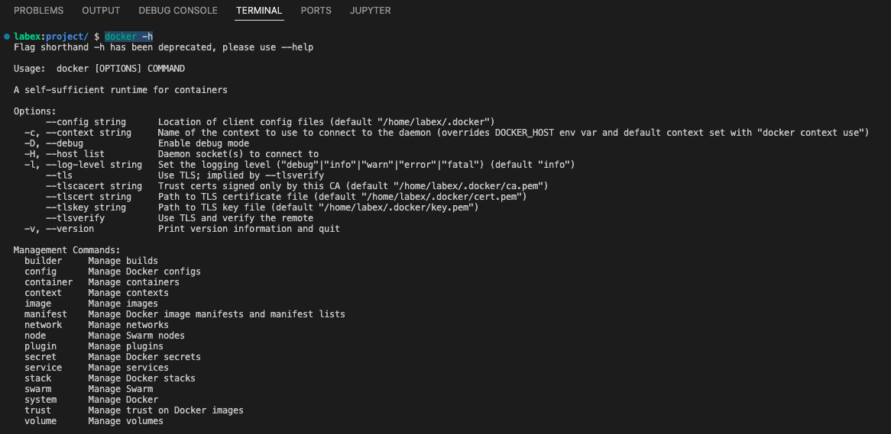

# Get Started

Open a terminal on LabEx VM and run the `docker -h`, which will show you the help page for the Docker CLI.



```bash
$ docker -h
Flag shorthand -h has been deprecated, please use --help

Usage:  docker [OPTIONS] COMMAND

A self-sufficient runtime for containers

...

Management Commands:
  builder     Manage builds
  config      Manage Docker configs
  container   Manage containers
  engine      Manage the docker engine
  image       Manage images
  network     Manage networks
  node        Manage Swarm nodes
  plugin      Manage plugins
  secret      Manage Docker secrets
  service     Manage services
  stack       Manage Docker stacks
  swarm       Manage Swarm
  system      Manage Docker
  trust       Manage trust on Docker images
  volume      Manage volumes
```

The Docker command line can be used to manage several features of the Docker Engine. In this lab, we will mainly focus on the `container` command.

Install `podman` on your LabEx VM.

```bash
sudo apt-get install podman
```

If `podman` is installed, you can run the alternative command for comparison.

```bash
sudo podman -h
```

You can additionally review the version of your Docker installation,

```bash
docker version

Client:
  Version:      20.10.21
  ...

Server:
 Engine:
  Version:      20.10.21
    ...
```

You note that Docker installs both a `Client` and a `Server: Docker Engine`. For instance, if you run the same command for podman, you will see only a CLI version, because podman runs daemonless and relies on an OCI compliant container runtime (runc, crun, runv etc) to interface with the OS to create the running containers.

```bash
sudo podman version --events-backend=none
Version:      3.4.4
API Version:  3.4.4
Go Version:   go1.17.3
Built:        Thu Jan  1 08:00:00 1970
OS/Arch:      linux/amd64
```
