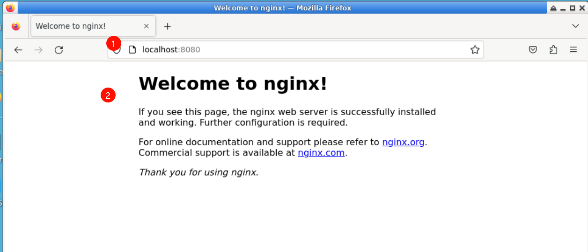
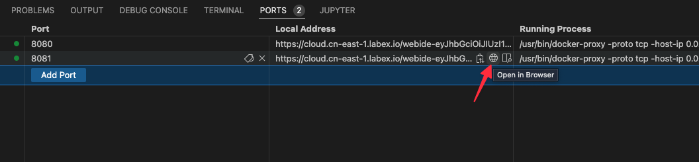

# 运行多个容器

## 探索 Docker Hub

[Docker Hub](https://hub.docker.com/explore/) 是 Docker 镜像的公共中央注册表，其中包含社区镜像和官方镜像。

在搜索镜像时，你会找到“Docker 认证”、“已验证发布者”和“官方镜像”等过滤器。选择“Docker 认证”过滤器，以查找被视为企业就绪且经过 Docker 企业版产品测试的镜像。在开发要部署到生产环境的自定义镜像时，避免使用来自 Docker 商店的未经验证的内容非常重要。这些未经验证的镜像可能包含安全漏洞甚至恶意软件。

在本实验的第 2 步中，我们将使用 Docker Hub 中的一些经过验证的镜像启动几个容器：Nginx 网络服务器和 MongoDB 数据库。

## 运行 Nginx 服务器

让我们使用 Docker Hub 中的 [官方 Nginx 镜像](https://hub.docker.com/_/nginx) 运行一个容器。

```bash
docker container run --detach --publish 8080:80 --name nginx nginx
```

这里我们使用了几个新标志。`--detach` 标志将在后台运行此容器。`publish` 标志通过我们主机上的 8080 端口发布容器中的 80 端口（Nginx 的默认端口）。请记住，NET 命名空间为容器的进程提供了自己的网络栈。`--publish` 标志是一项功能，它允许我们通过容器将网络暴露到主机上。

你怎么知道 80 端口是 Nginx 的默认端口呢？因为它列在 Docker Hub 上的 [文档](https://hub.docker.com/_/nginx) 中。一般来说，经过验证的镜像的文档非常完善，在使用这些镜像运行容器时你会想要参考它们。

我们还指定了 `--name` 标志，用于为容器命名。每个容器都有一个名称，如果你不指定，Docker 会为你随机分配一个。指定自己的名称会使在容器上运行后续命令变得更容易，因为你可以引用名称而不是容器的 ID。例如：`docker container inspect nginx` 而不是 `docker container inspect 5e1`。

由于这是你第一次运行 Nginx 容器，它将从 Docker 商店拉取 Nginx 镜像。后续从 Nginx 镜像创建的容器将使用位于你主机上的现有镜像。

Nginx 是一个轻量级的网络服务器。你可以在 LabEx VM 的“Web 8080”标签中访问 Nginx 服务器。切换到该标签并刷新页面以查看 Nginx 的输出。



## 运行 `mongo` 数据库服务器

现在，运行一个 MongoDB 服务器。我们将使用 Docker Hub 中的 [官方 MongoDB 镜像](https://hub.docker.com/_/mongo)。我们将使用特定版本的 mongo 镜像：4.4，而不是使用 `latest` 标签（如果未指定标签，这是默认值）。

```bash
docker container run --detach --publish 8081:27017 --name mongo mongo:4.4
```

同样，由于这是我们第一次运行 mongo 容器，我们将从 Docker 商店拉取 mongo 镜像。我们使用 `--publish` 标志在我们的主机上暴露 27017 mongo 端口。我们必须使用除 8080 之外的端口进行主机映射，因为该端口已经在我们的主机上被暴露了。再次参考 Docker Hub 上的 [官方文档](https://hub.docker.com/_/mongo) 以获取有关使用 mongo 镜像的更多详细信息。

在 Web 浏览器中使用 `0.0.0.0:8081` 查看 MongoDB 的输出。你应该会看到一条消息，该消息将返回来自 MongoDB 的警告。



使用 `docker container ls` 检查你正在运行的容器

```bash
$ docker container ls
CONTAINER ID IMAGE COMMAND CREATED STATUS PORTS NAMES
d6777df89fea nginx "nginx -g 'daemon..." 不到一秒前 已启动 2 秒 0.0.0.0:8080- nginx > 80/tcp
ead80a0db505 mongo "docker-entrypoint..." 17 秒前 已启动 19 秒 0.0.0.0:8081- mongo > 27017/tcp
af549dccd5cf ubuntu "top" 5 分钟前 已启动 5 分钟 priceless_kepler
```

你应该会看到你有一个 Nginx 网络服务器容器和一个 MongoDB 容器在你的主机上运行。请注意，我们尚未配置这些容器相互通信。

你可以看到我们给容器起的“nginx”和“mongo”名称，以及为 ubuntu 容器生成的随机名称（在我的例子中是“priceless_kepler”）。你还可以看到我们使用 `--publish` 标志指定的端口映射。有关这些正在运行的容器的更多详细信息，你可以使用 `docker container inspect [容器 ID` 命令。

你可能会注意到的一件事是，mongo 容器正在运行 `docker-entrypoint` 命令。这是容器启动时运行的可执行文件的名称。mongo 镜像在启动数据库进程之前需要一些预先配置。你可以通过在 [github](https://github.com/docker-library/mongo) 上查看它来确切了解该脚本的作用。通常，你可以从 Docker 商店网站上的镜像描述页面找到到 github 源代码的链接。

容器是自包含且隔离的，这意味着我们可以避免具有不同系统或运行时依赖项的容器之间的潜在冲突。例如：在同一主机上部署使用 Java 7 的应用程序和使用 Java 8 的另一个应用程序。或者运行多个默认监听端口均为 80 的 Nginx 容器（如果使用 `--publish` 标志在主机上暴露，为主机选择的端口需要是唯一的）。由于 Linux 命名空间，隔离的好处是可能实现的。

**注意**：除了 Docker 之外，你无需在主机上安装任何东西即可运行这些进程！每个容器在容器内部都包含它所需的依赖项，因此你无需直接在主机上安装任何东西。

在同一主机上运行多个容器使我们能够充分利用单个主机上可用的资源（CPU、内存等）。这可以为企业节省大量成本。

虽然有时直接从 Docker Hub 运行镜像可能会很有用，但创建自定义镜像并将官方镜像作为这些镜像的起点会更有用。我们将在实验 2 中深入探讨构建我们自己的自定义镜像。
