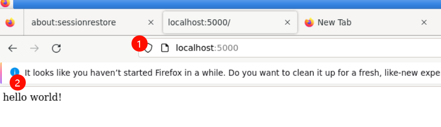

# Create a `Python` App (without Using Docker)

Run the following command to create a file named `app.py` with a simple python program. (copy-paste the entire code block)

```bash
cd ~/project
```

```bash
echo 'from flask import Flask

app = Flask(__name__)

@app.route("/")
def hello():
    return "hello world!"

if __name__ == "__main__":
    app.run(host="0.0.0.0")' > app.py
```

This is a simple python app that uses flask to expose a http web server on port 5000 (5000 is the default port for flask). Don't worry if you are not too familiar with python or flask, these concepts can be applied to an application written in any language.

**Optional:** If you have python and pip installed, you can run this app locally. If not, move on to the next step.

```bash
$ python3 --version
$ pip3 --version
$ pip3 install flask

$ python3 app.py
 * Serving Flask app "app" (lazy loading)
 * Environment: production
   WARNING: This is a development server. Do not use it in a production deployment.
   Use a production WSGI server instead.
 * Debug mode: off
 * Running on http://0.0.0.0:5000/ (Press CTRL+C to quit)
```

Open the app in a new browser tab using `http://0.0.0.0:5000/`.


