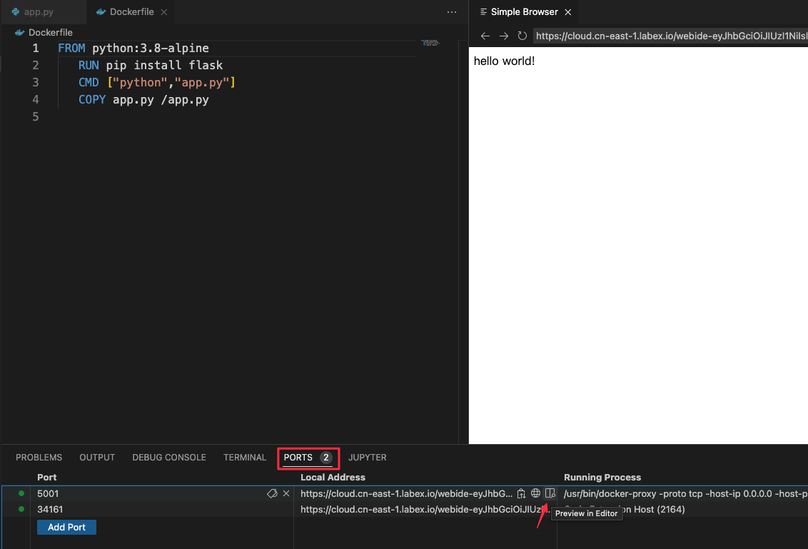

# Run the Docker Image

Now that you have built the image, you can run it to see that it works.

Run the Docker image

```bash
docker run -p 5001:5000 -d python-hello-world
```

The `-p` flag maps a port running inside the container to your host. In this case, we are mapping the python app running on port 5000 inside the container, to port 5001 on your host. Note that if port 5001 is already in use by another application on your host, you may have to replace 5001 with another value, such as 5002.

Navigate to **PORTS** tab in the terminal window and click on the link to open the app in a new browser tab.



In a terminal run `curl localhost:5001`, which returns `hello world!`.

Check the log output of the container.

If you want to see logs from your application you can use the `docker container logs` command. By default, `docker container logs` prints out what is sent to standard out by your application. Use `docker container ls` to find the id for your running container.

```bash
labex:project/ $ docker container ls
CONTAINER ID   IMAGE                COMMAND           CREATED         STATUS         PORTS                                       NAMES
52df977e5541   python-hello-world   "python app.py"   2 minutes ago   Up 2 minutes   0.0.0.0:5001->5000/tcp, :::5001->5000/tcp   heuristic_lamport
labex:project/ $ docker container logs 52df977e5541
 * Serving Flask app 'app'
 * Debug mode: off
WARNING: This is a development server. Do not use it in a production deployment. Use a production WSGI server instead.
 * Running on all addresses (0.0.0.0)
 * Running on http://127.0.0.1:5000
 * Running on http://172.17.0.2:5000
Press CTRL+C to quit
172.17.0.1 - - [23/Jan/2024 02:43:10] "GET / HTTP/1.1" 200 -
172.17.0.1 - - [23/Jan/2024 02:43:10] "GET /favicon.ico HTTP/1.1" 404 -
```

The Dockerfile is how you create reproducible builds for your application. A common workflow is to have your CI/CD automation run `docker image build` as part of its build process. Once images are built, they will be sent to a central registry, where it can be accessed by all environments (such as a test environment) that need to run instances of that application. In the next step, we will push our custom image to the public docker registry: the docker hub, where it can be consumed by other developers and operators.
