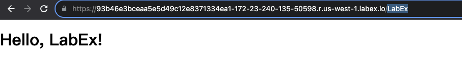

# Exécution de l'application à nouveau

Exécutons à nouveau l'application et testons la fonctionnalité de contenu dynamique.

1. Arrêtez le serveur de développement Flask s'il est toujours en cours d'exécution (appuyez sur Ctrl+C).
2. Exécutez la commande suivante pour redémarrer le serveur :

   ```bash
   flask run --host=0.0.0.0
   ```

3. Copiez l'URL de l'onglet **Web 5000** et collez-la dans un nouvel onglet de votre navigateur.


4. Ajoutez `/LabEx` à la fin de l'URL et appuyez sur Entrée.



5. Changez la valeur du paramètre `name` dans l'URL et appuyez sur Entrée.
