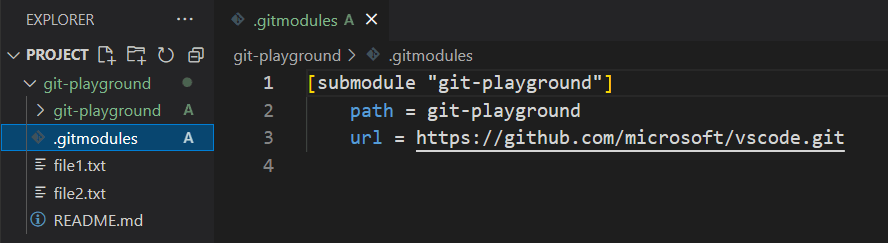

# Agregar un submódulo

Tu tarea es agregar un nuevo submódulo a un repositorio Git. Necesitarás agregar el submódulo desde un repositorio remoto a un directorio local en tu repositorio.

## Tareas

Supongamos que tienes un repositorio Git llamado `my-project` y quieres agregar un submódulo desde el repositorio Git `https://github.com/labex-labs/git-playground.git` a un directorio llamado `git-playground` en tu repositorio local.

Este es el resultado después de completar el desafío:

