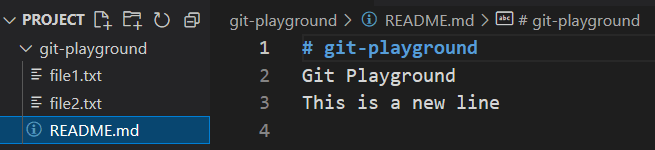

# Применить последнее сохранение

Вы работаете над проектом в своем репозитории Git и внесли некоторые изменения, которые еще не готовы быть закоммичены. Однако, вам нужно переключиться на другую ветку или коммит, чтобы работать над другой функцией. Вы не хотите потерять свои изменения, поэтому решаете сохранить их. Позже, когда будете готовы продолжить работу над своими изменениями, вам нужно применить последнее сохранение к своей рабочей директории.

## Задачи

Чтобы применить последнее сохранение к вашему репозиторию Git, следуйте шагам:

1. Список ваших сохранений. В списке должен быть одно сохранение.
2. Применить последнее сохранение к своей рабочей директории.
3. Проверить файл `README.md`, чтобы убедиться, что ваши изменения были применены.

Вот результат выполнения команды `cat README.md`:

Эта команда повторно применяет изменения из последнего сохраненного состояния к текущей рабочей директории и добавляет новую строку "This is a new line" в файл `README.md`.
