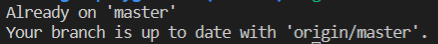

# Find the Commit that Introduced a Bug

## Problem

Your task is to use Git's `bisect` command to find the commit that introduced a bug in the `https://github.com/labex-labs/git-playground` repository. The bug causes the `npm test` command to fail.

## Example

1. Clone the `https://github.com/labex-labs/git-playground` repository.
2. Run `npm install` to install the project dependencies.
3. Run `npm test` to see the failing test.
4. Start the `bisect` process.
5. Use the git log --full-history command to see the full history of commits.
6. Use a command to mark a `<commit>` as "good", indicating it is known to be bug-free.
6. Use a command to mark a different `<commit>` as "bad" indicating it has the bug.
7. Use a command to run the `npm test` command on each subsequent commit to find which commit introduce the bug.
8. Once the bad commit is found, use a command to reset to the original branch.

This is the result after completing the challenge:

