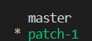

# Find Branches Containing a Commit

## Problem

You have been given a Git repository named `https://github.com/labex-labs/git-playground`. Your task is to find all the branches that contain the commit with the hash `3050fc0d3`.

## Example

1. Change into the repository directory.

2. Create branches called `patch-1` on the `master` branch.

3. Use a command to find all the branches containing the commit with the hash `d22f46b`:

The output should be:

