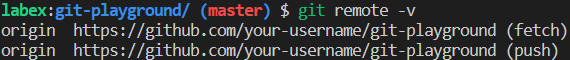

# Change the Remote URL

You have cloned a repository from GitHub and made some changes to it. However, you now realize that you need to change the URL of the remote repository. This could be because the original repository has been moved to a different location, or because you want to push your changes to a different remote repository. Your task is to change the remote URL of the repository using Git commands.

## Example

Assume that you have cloned the repository `https://github.com/labex-labs/git-playground` to your local machine. To change the remote URL of the repository to `https://github.com/your-username/git-playground`.

1. Open the terminal or command prompt and navigate to the local repository.
2. Use a command to view the current remote URL.
3. Use a command to change the remote URL to the new URL.
4. Use a command to verify that the remote URL has been changed.

The output should show the new URL instead of the old one:

