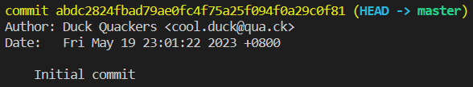

# Change the Last Commit's Author

## Problem

You have just made a commit to your Git repository, but you realized that the author's name and email address are incorrect. You want to update the author's information without changing the contents of the commit. How can you achieve this using Git?

## Example

To change the last commit's author, you can use a command. This command allows you to modify the last commit in your Git repository.

1. Navigate to the repository and configure Git's identity information using your GitHub account.
2. Make some changes to the files in the repository. For example, add the text `Hello, World` to the file `hello`.txt and create a new commit with the commit message set to `Initial commit`.
3. Use a command to change the author of the last commit to `Duck Quackers`, whose email address is `cool.duck@qua.ck` and save the contents.
4. Verify that the author's information has been updated.

You should see that the last commit's author is now `Duck Quackers`:

