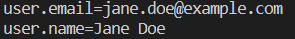

# Configure Git User Information

## Problem

You have just started working on a new project and want to configure your user information for Git. You want to make sure that your name and email address are associated with any changes you make to the repository.
  
## Example

For this challenge, we will be using the Git repository named `https://github.com/labex-labs/git-playground`.

1. Navigate to the cloned repository.
2. Set your user information for the repository. For example, if your email address is `jane.doe@example.com` and your name is `Jane Doe`.
3. Verify that your user information has been set correctly by using the following command: `git config --list`.

This is the result after completing the challenge:

