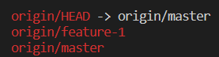

# Create a New Branch

## Problem

For this challenge, fork the Git repository named `https://github.com/labex-labs/git-playground` into your GitHub account.You are working on a project in a Git repository named `https://github.com/your-username/git-playground`. You need to create a new branch named `feature-1` to work on a new feature.

## Example

1. Clone the repository, navigate to the directory and configure the identity.
2. Check the current branch.
3. Create a new branch named `feature-1`.
4. Verify that you are now on the `feature-1` branch.
5. Push the changes to the remote repository.

This is what happens when you run the `git branch -r` command:

