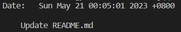

# Create a Git Commit

## Problem

You have made some changes to your code and want to save them as a snapshot in your Git repository. However, you don't want to save all the changes you made, only the ones that are relevant to the current feature or bug fix. How can you create a commit containing only the relevant changes?

## Example

For this challenge, let's use the repository from `https://github.com/labex-labs/git-playground`.

1. Navigate to the directory and configure the identity in the environment.
2. Add "hello,labex" to the `README.md` file, add it to the staging area and commit it with the message "Updating README.md".

This is the result of running the `git log` command:

