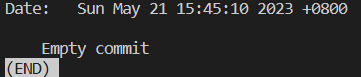

# Create an Empty Commit

You need to create an empty commit in your Git repository. This can be useful in several scenarios, such as:

- Triggering a build process
- Creating a placeholder commit
- Marking a specific point in the repository's history

## Example

For this challenge, let's use the repository from `https://github.com/labex-labs/git-playground`.

1. Navigate to the repository directory and configure your GitHub identity in the environment.
2. Create an empty commit with the message "Empty commit".
3. Verify that the empty commit was created.

This is where you run `git log --name-status HEAD^..HEAD` and the result:

