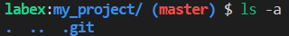

# Create a New Repository

You have been tasked with creating a new Git repository for a project. You need to set up all the configuration files needed by Git and ensure that the repository is properly initialized.

## Example

Suppose you want to create a new Git repository for a project called `my_project`:

1. Open your terminal or command prompt.
2. Navigate to the directory where you want to create the repository,e.g:`/home/labex/project/my_project`.
3. Initialize a new Git repository in the `my_project` directory.
4. You can now add files to the repository and commit changes.

There is the finished result:

