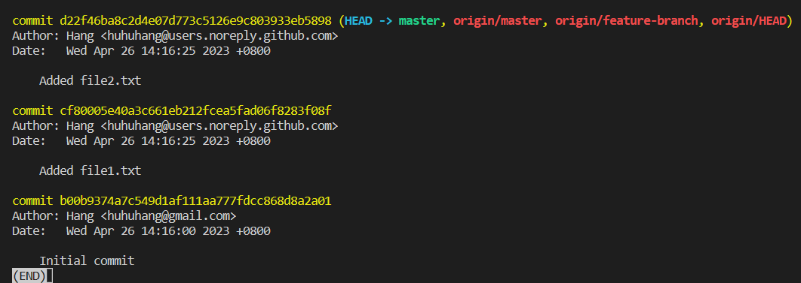

# Fetch Latest Changes from Remote

## Problem

Suppose you are working on a project with a team of developers, and the project is stored in a remote repository. You want to get the latest changes from the remote repository without applying them to your local repository. 

## Example

You will use the `git-playground` repository hosted on GitHub. 

1. Change your working directory to the `git-playground` directory.
2. Fetch the latest changes from the remote repository.
3. Verify that the latest changes have been fetched.

This is the result of running `git log origin/master`:

