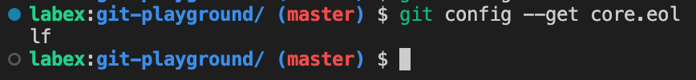

# Configurar los finales de línea

Estás trabajando en un proyecto con un equipo de desarrolladores y notas que algunos miembros del equipo están utilizando diferentes finales de línea que otros. Esto puede causar problemas al fusionar el código y puede llevar a conflictos. Necesitas configurar los finales de línea para el repositorio para garantizar la consistencia y evitar conflictos.

## Tareas

Para configurar los finales de línea para el repositorio `git-playground`, sigue estos pasos:

1. Navega hasta el directorio donde se encuentra el repositorio `git-playground` (`~/project/git-playground`).
2. Configura los finales de línea para usar finales de línea UNIX (`\n`).
3. Verifica que los finales de línea se hayan configurado correctamente.

## Ejemplo

Para verificar que los finales de línea se hayan configurado correctamente, puedes usar el siguiente comando:

```bash
git config --get core.eol
```

Si los finales de línea se han configurado correctamente, el comando devolverá `lf`.


