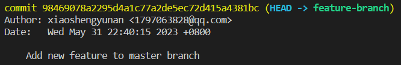

# Move Commits to a New Branch

## Problem

To complete this experiment, you will use the Git repository `git-playground` from your GitHub account, which comes from a fork of `https://github.com/labex-labs/git-playground.git`.You have been working on a project in the `master` branch of the `https://github.com/your-username/git-playground` repository. You realize that some of the changes you made should have been made on a separate branch. You want to move these changes to a new branch called `feature-branch`.

## Example

1. Clone the `https://github.com/your-username/git-playground` repository to your local machine.
2. Checkout the `master` branch.
3. Make some changes to the codebase, add them and commit them with the message "Add new feature to master branch".
4. Create a new branch called "feature-branch" and switch to the "feature-branch" branch.
5. Move the last commit from `master` to `feature-branch`.
6. Verify that the changes are now in the `feature-branch`.

This is the result of running `git log`:

