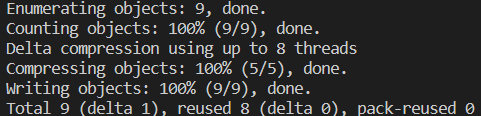

# Optimize the Local Repository

Over time, your Git repository can become cluttered with old versions of files and other unnecessary data. This can slow down Git and make it harder to work with your repository. To optimize your local repository, you need to remove this unnecessary data.

When you run the command, Git will remove any loose objects (objects that are not referenced by any branch or tag) and pack the remaining objects into a new set of pack files. This can significantly reduce the size of your repository and improve Git's performance.

## Tasks

For example, let's say you have a Git repository named `git-playground` located in your home directory and optimize this repository.

This is the result of optimising the `git-playground` repository by removing all loose objects and packing the remaining objects into a new set of pack files:

