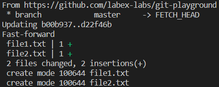

# Pull Latest Changes from Remote

## Problem

You are working on a project with a team of developers, and you need to ensure that your local copy of the codebase is up to date with the latest changes made by your team members. To do this, you need to pull the latest changes from the remote repository.

## Example

For this challenge, we will be using the Git repository named `https://github.com/labex-labs/git-playground`.

1. Change into the directory of the cloned repository.
2. Pull the latest changes from the `master` branch of the remote repository.

After completing the challenge, you should see a message indicating that your local copy of the repository is up to date with the remote repository.

This is the result after pulling:

