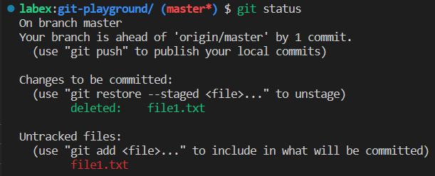

# Git Challenge: Remove a File from the Last Commit

## Problem

You have added a file to the last commit that you didn't intend to include. You want to remove the file from the last commit without changing its message.

## Example

To complete this experiment, you will use the Git repository `git-playground` from your GitHub account, which comes from a fork of `https://github.com/labex-labs/git-playground.git`.Suppose you have a Git repository named `git-playground` with a file named `file1.txt` that you accidentally added to the last commit.

1. Create the `git-playground.txt` file and modify the `file1.txt` file and add them to the staging area at the same time, committing them with the message "add git-playground.txt".
2. Remove the specified `file1.txt` from the index.
3. Update the contents of the last commit, without changing its message.

After running these commands, the file `file1.txt` will be removed from the last commit without changing its message.

This is what happens when you remove `file1.txt` from Git version control:

