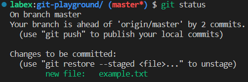

# Restore a Deleted File

## Problem

You are working on a project using Git and accidentally deleted a file that you need. Fortunately, you know the commit where the file was deleted. Your task is to restore the deleted file using Git.

## Example

To complete this challenge, you will use the Git repository `git-playground` from your GitHub account, which comes from a fork of `https://github.com/labex-labs/git-playground.git`.

1. Clone the repository to your local machine from `https://github.com/your-username/git-playground`.
2. Navigate to the repository directory.
3. Create a new file called `example.txt`.
4. Add and commit the file to the repository.
5. Delete the `example.txt` file.
6. View the commit history.
7. Identify the commit where the file was deleted.
8. Restore the deleted file by checking out the commit before the deletion.

This is the result of running `git status`:

This will restore the `example.txt` file to your local repository.
