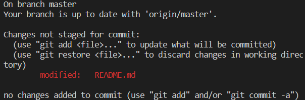

# Create a Git Stash

## Problem

As a developer, you may find yourself in a situation where you need to switch to a different branch or work on a different feature, but you're not ready to commit your changes yet. You don't want to lose your progress, but you also don't want to commit incomplete or buggy code. This is where a stash comes in handy.

A stash allows you to save your changes without committing them, so you can switch to a different branch or work on a different feature. You can then apply your stash later when you're ready to continue working on your changes.

## Example

Let's say you're working on a branch named `feature` in the `git-playground` repository and you want to save your changes before switching to a different branch:

1. First, navigate to the `git-playground` directory.
2. Switch to a branch named `feature`.
3. Add the line "Some changes" to the `README.md` file.
4. Save your changes to a stash and add a descriptive message "My changes" to that stash.
5. Switch to a different branch.
6. Apply your stash.

This is the finished result:

