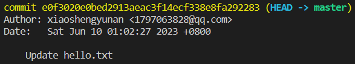

# Configure the git text editor

## Problem

You want to configure the text editor used by Git to your preferred editor.

## Example

1. Clone the `git-playground` repository from `https://github.com/labex-labs/git-playground.git`.
2. Navigate to the cloned repository.
3. Configure Git to use your preferred text editor (in this example, we will use vim).
4. Update the contents of the `hello.txt` file to "Hello, Git" and stage it for commit.
5. Commit the change.
6. Your preferred text editor (in this example, vim) should open with the commit message. Write down your commit message "Update hello.txt" and save the file.
7. Close the text editor. The commit will be made with the message you wrote.

This is the finished result:




1. Clone the `git-playground` repository:

```shell
git clone https://github.com/labex-labs/git-playground.git
```

2. Navigate to the cloned repository:

```shell
cd git-playground
```

3. Configure Git to use your preferred text editor (in this example, we will use vim):

```shell
git config --global core.editor "vim"
```

4. Make a change to a file and stage it for commit:

```shell
echo "Hello, Git" > hello.txt
git add hello.txt
```

5. Commit the change:

```shell
git commit
```

6. Your preferred text editor (in this example, vim) should open with the commit message. Write down your commit message "Update hello.txt" and save the file.

7. Close the text editor. The commit will be made with the message you wrote.

