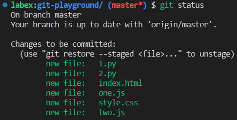

# Agregar archivos al área de preparación

Has estado trabajando en un proyecto almacenado en un repositorio de Git llamado `https://github.com/labex-labs/git-playground`. Has realizado algunos cambios en la base de código y quieres confirmar estos cambios en el repositorio. Sin embargo, solo quieres confirmar cambios específicos y no todos los cambios que has realizado. Para hacer esto, necesitas agregar los archivos al área de preparación.

## Tareas

1. Ver todos los archivos en el directorio actual.
2. Supongamos que has realizado cambios en los archivos `index.html` y `style.css` en el directorio `git-playground` del repositorio `git-playground`. Agrega estos archivos al área de preparación.
3. Ver el estado del directorio de trabajo actual y del área de preparación, incluyendo información sobre qué archivos han sido modificados, qué archivos han sido agregados al área de preparación, etc.
4. Alternativamente, agrega todos los archivos con extensión `.js` en el directorio `src`.
5. Ver nuevamente el estado del directorio de trabajo actual y del área de preparación.
6. También puedes agregar todos los cambios al área de preparación.
7. Ver nuevamente el estado del directorio de trabajo actual y del área de preparación.

Este es el resultado final:

