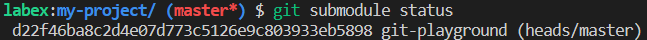

# Ajouter un sous-module

Votre tâche consiste à ajouter un nouveau sous-module à un référentiel Git. Vous devrez utiliser la commande `git submodule add` pour ajouter le sous-module à partir d'un référentiel distant vers un répertoire local dans votre référentiel. La syntaxe de la commande est la suivante :

```shell
git submodule add <upstream-path> <local-path>
```

- `<upstream-path>` est l'URL ou le chemin vers le référentiel distant que vous voulez ajouter en tant que sous-module.
- `<local-path>` est le chemin où vous voulez stocker le sous-module dans votre référentiel local.

Supposons que vous ayez un référentiel Git nommé `my-project` et que vous vouliez ajouter un sous-module à partir du référentiel Git `https://github.com/labex-labs/git-playground.git` dans un répertoire nommé `git-playground` de votre référentiel local. Voici comment vous pouvez le faire :

```shell
git init my-project
cd my-project
git submodule add https://github.com/labex-labs/git-playground.git./git-playground
```

Voici le résultat après avoir terminé le laboratoire :


