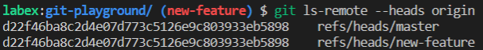

# Automatisieren der Erstellung von upstream-Branches

Als Entwickler möchten Sie den Prozess der Erstellung von upstream-Branches beim Push automatisieren, um das Ärgernis zu vermeiden, den Branch manuell auf dem Remote-Repository zu erstellen.

Für diese Übung werden Sie das Repository `https://github.com/labex-labs/git-playground` in Ihr Konto forken und das Repository auf Ihrem Konto verwenden, um beim Push automatisch den upstream-Branch zu erstellen.

1. Melden Sie sich auf der GitHub-Website bei Ihrem Konto an und finden Sie `https://github.com/labex-labs/git-playground`, um das Repository in Ihr Konto zu forken.
2. Klicken Sie auf der Seite Ihres eigenen geforkten Repositorys auf die Schaltfläche `Code` und kopieren Sie die URL des Repositorys.
3. Klonen Sie das Repository, navigieren Sie zum Verzeichnis und konfigurieren Sie die Identität:

```shell
git clone https://github.com/your-username/git-playground.git
cd git-playground
git config --global user.name "your-username"
git config --global user.email "your-email"
```

4. Verwenden Sie den folgenden Befehl, um die automatische Erstellung von upstream-Branches beim Push zu aktivieren:

```shell
git config --global push.default current
```

5. Drücken Sie einen neuen Branch namens `new-feature`, der auf dem Remote-Repository nicht existiert:

```shell
git checkout -b new-feature
git push
```

6. Vergewissern Sie sich, dass der neue Branch auf dem Remote-Repository erstellt wurde:

```shell
git ls-remote --heads origin
```

Dies ist das Ergebnis nach Abschluss der Übung:


