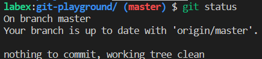
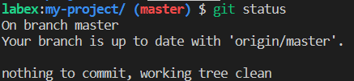

# Clone a Repository

As a developer, you often need to work on code that is stored in a remote repository. Cloning the repository allows you to create a local copy of the code that you can work on and modify without affecting the original codebase. This is useful for making changes, testing new features, and collaborating with others.

To clone a repository, you will need to use the `git clone` command followed by the URL of the repository you want to clone. For example, let's say you want to clone the `git-playground` repository from `https://github.com/labex-labs/git-playground.git`. You can do this by running the following command in your terminal:

```shell
git clone https://github.com/labex-labs/git-playground.git
```

This will create a new directory named `git-playground` in your current working directory, which contains a local copy of the `git-playground` repository.

If you want to clone the repository into a specific directory, you can specify the directory name as a second argument to the `git clone` command. For example, to clone the repository into a directory named `my-project`, you can run the following command:

```shell
git clone https://github.com/labex-labs/git-playground.git my-project
```

This will create a new directory named `my-project` in your current working directory, which contains a local copy of the `git-playground` repository.

Here are the results after completing the lab:



