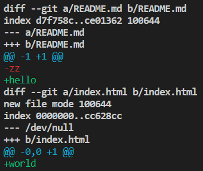

# Difference Between Branches

You have been working on a project with your team, and you have created a branch named `feature-1` to work on a new feature. Your colleague has also created a branch named `feature-2` to work on a different feature. You want to compare the changes between the two branches to see what has been added, modified, or deleted. How can you view the difference between the two branches?

To complete this experiment, you will use the Git repository `git-playground` from your GitHub account, which comes from a fork of `https://github.com/labex-labs/git-playground.git`.Follow the steps below:

1. Clone the repository to your local machine using the command `git clone https://github.com/your-username/git-playground`.
2. Change to the repository's directory using the command `cd git-playground`.
3. Configure your GitHub account in this environment using the commands `git config --global user.name "Your Name"` and `git config --global user.email "your@email.com"`.
4. Create a new branch named `feature-1` using the command `git checkout -b feature-1`.
5. Make some changes to the `README.md` file using your favorite text editor.
6. Add changes from `README.md` to Git's staging area using the command `git add README.md`.
7. Commit the changes using the command `git commit -am "Add new content to README.md"`.
8. Create a new branch named `feature-2` using the command `git checkout -b feature-2`.
9. Make some changes to the `index.html` file using your favorite text editor.
10. Add changes from `index.html` to Git's staging area using the command `git add index.html`.
11. Commit the changes using the command `git commit -am "Update index.html file"`.
12. View the difference between the two branches using the command `git diff feature-1..feature-2`.

The output should display the difference between the `feature-1` and `feature-2` branches.This shows how the final result will look like：

