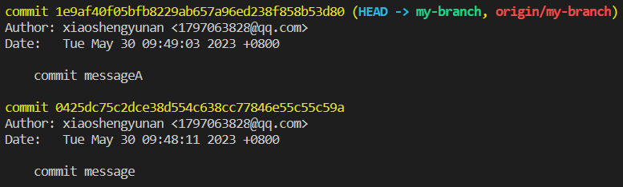

# Perform an Interactive Rebase

You are working on a project with a team of developers, and you have made several commits to your branch. However, you realize that some of the commits are unnecessary or need to be combined. You want to clean up your commit history and make it more organized.

To complete this lab,you will fork `https://github.com/labex-labs/git-playground` to your GitHub account and use the Git repository named `https://github.com/your-username/git-playground` in your environment. Follow these steps:

1. Clone the repository to your local machine using the command `git clone https://github.com/your-username/git-playground`.
2. Navigate to the directory using the command `cd git-playground`.
3. Create a new branch using the command `git checkout -b my-branch`.
4. Make some file changes, e.g. add "hello" to `file1.txt` and add it to the staging area using the commands `echo "hello" > file1.txt` and `git add . `.
5. Make several commits to the branch using the command `git commit -m "commit message"`.
6. Run the command `git rebase -i HEAD~3` to perform an interactive rebase of the last 3 commits.
7. The interactive rebase file will open in your default text editor. You can modify the order of the commits and the action to perform for each one (pick, squash, drop, reword etc.).
8. Save and close the file.
9. If there are merge conflicts or you need to make changes, you can continue the rebase when ready using `git rebase --continue` or abort it using `git rebase --abort`.
10. Once the rebase is complete, push the changes to the remote repository using the command `git push -u origin my-branch`.

Running `git log origin/my-branch` will give you a result that looks like this:

