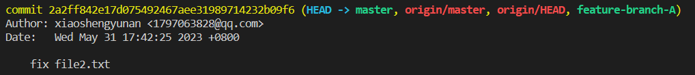

# Merge a Branch

Your task is to merge a branch into the current branch using Git. You will need to switch to the target branch and then merge the source branch into it. This can be useful when you want to combine changes from a `feature-branch-A` into the `master` branch of your project.

To complete this experiment, you will use the Git repository `git-playground` from your GitHub account, which comes from a fork of `https://github.com/labex-labs/git-playground.git`. Follow these steps to merge the `feature-branch-A` into the `master` branch:

1. Clone the repository to your local machine using the command `git clone https://github.com/your-username/git-playground`.
2. Create a `feature-branch-A` branch and add "hello" to `file2.txt` using the commands `git checkout -b feature-branch-A` and `echo "hello" > file2.txt`.
3. Add the changes to the staging area and commit with the message "fix file2.txt" using the commands `git add file2.txt` and `git commit -m "fix file2.txt"`.
4. Use the command `git checkout master` to switch to the `master` branch.
5. Use the command `git merge feature-branch-A` to merge the `feature-branch-A` into the `master` branch.
6. Resolve any conflicts that may arise during the merge process.
7. Use the command `git push` to push the changes to the remote repository.

This is the result of running `git log`:

