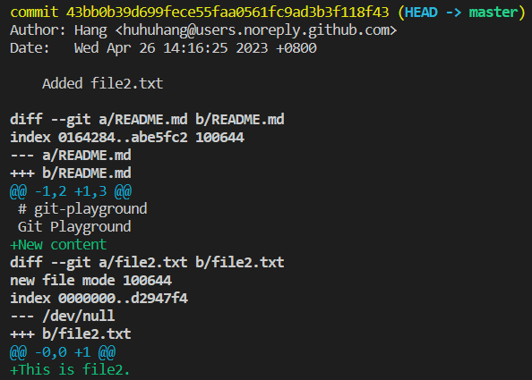

# Den letzten Commit bearbeiten

Du hast gerade einige Änderungen an deinem Git-Repository committet, stellst jedoch fest, dass du eine Datei vergessen hast oder eine kleine Änderung gemacht hast. Du willst nicht einen neuen Commit nur für diese kleine Änderung erstellen, aber du willst auch die Commit-Nachricht nicht ändern. Wie kannst du den letzten Commit bearbeiten, ohne seine Nachricht zu ändern?

Um zu demonstrieren, wie man den letzten Commit bearbeitet, verwenden wir das Repository von `https://github.com/labex-labs/git-playground`.

1. Klone das Repository, navigiere zum Verzeichnis und konfiguriere die Identität:

```shell
git clone https://github.com/labex-labs/git-playground
cd git-playground
git config --global user.name "your-username"
git config --global user.email "your-email"
```

2. Stelle fest, dass du eine Datei vergessen hast oder eine kleine Änderung gemacht hast. Füge den Text "Neuer Inhalt" am Ende der `README.md`-Datei hinzu. Füge alle vorgespannten Änderungen zum letzten Commit hinzu, ohne seine Nachricht zu ändern:

```shell
echo "Neuer Inhalt" >> README.md
git add README.md
git commit --amend --no-edit
```

3. Verifiziere, dass der letzte Commit jetzt die Änderungen enthält, die du gemacht hast:

```shell
git show HEAD
```

Dies ist der Inhalt des späteren Commits:

