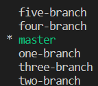

# Ver ramas locales

Has estado trabajando en un repositorio Git llamado `https://github.com/labex-labs/git-playground`. Quieres ver una lista de todas las ramas locales en el repositorio.

1. Navega hasta el repositorio clonado usando el siguiente comando:
   ```
   cd git-playground
   ```
2. Utiliza el siguiente comando para ver una lista de todas las ramas locales:
   ```
   git branch
   ```
   Verás una lista de todas las ramas locales en el repositorio. Utiliza las flechas para navegar por la lista y presiona <kbd>Q</kbd> para salir.

Este es el resultado final:

