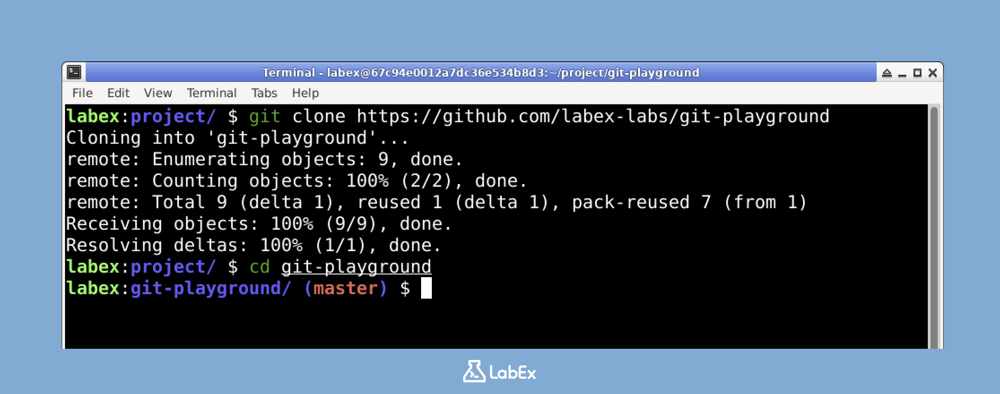

# Klonen des Git-Repositorys

Um die Fähigkeiten von Git zur Datumsbereichsfilterung zu erkunden, benötigen wir zunächst ein Git-Repository, mit dem wir arbeiten können. Wir werden das `git-playground`-Repository verwenden, das von LabEx zur Verfügung gestellt wird.

Beginnen wir damit, das Repository zu klonen:

1. Öffnen Sie Ihr Terminal in der LabEx-VM.



2. Führen Sie den folgenden Befehl aus, um das Repository zu klonen:

```bash
git clone https://github.com/labex-labs/git-playground
```

Sie sollten eine Ausgabe ähnlich der folgenden sehen:

```
Cloning into 'git-playground'...
remote: Enumerating objects: 8, done.
remote: Counting objects: 100% (8/8), done.
remote: Compressing objects: 100% (5/5), done.
remote: Total 8 (delta 0), reused 8 (delta 0), pack-reused 0
Receiving objects: 100% (8/8), done.
```

3. Navigieren Sie in das Verzeichnis des Repositorys:

```bash
cd git-playground
```

Jetzt, da wir das Repository auf unserem lokalen Rechner haben, können wir mit der Erkundung der Commit-Historie beginnen.
