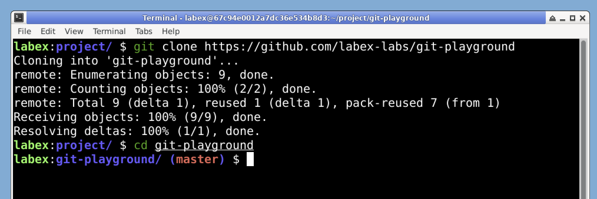

# Git リポジトリのクローン

Git の日付範囲フィルタリング機能を調べ始めるには、まず作業対象の Git リポジトリが必要です。ここでは LabEx が提供する `git-playground` リポジトリを使用します。

リポジトリをクローンすることから始めましょう。

1. LabEx の仮想マシン (VM) でターミナルを開きます。



2. 次のコマンドを実行してリポジトリをクローンします。

```bash
git clone https://github.com/labex-labs/git-playground
```

以下のような出力が表示されるはずです。

```
Cloning into 'git-playground'...
remote: Enumerating objects: 8, done.
remote: Counting objects: 100% (8/8), done.
remote: Compressing objects: 100% (5/5), done.
remote: Total 8 (delta 0), reused 8 (delta 0), pack-reused 0
Receiving objects: 100% (8/8), done.
```

3. リポジトリのディレクトリに移動します。

```bash
cd git-playground
```

これでローカルマシンにリポジトリがあるので、コミット履歴の調査を始めることができます。
