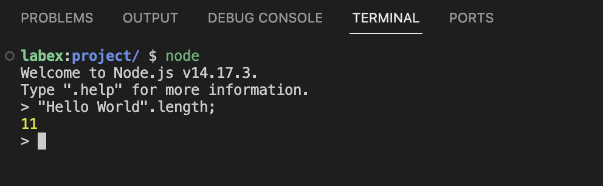

# Das Verständnis der JavaScript-Zeichenkettenrepräsentation

Bevor wir die Byte-Größe von Zeichenketten berechnen, ist es wichtig zu verstehen, wie Zeichenketten in JavaScript repräsentiert werden.

In JavaScript sind Zeichenketten Sequenzen von UTF-16-Codeeinheiten. Das bedeutet, dass Zeichen wie Emojis oder bestimmte Symbole möglicherweise mehr als ein Byte zur Darstellung benötigen. Beispielsweise nimmt ein einfacher englischer Buchstabe 1 Byte ein, während ein Emoji 4 Bytes benötigen kann.

Beginnen wir damit, Node.js im Terminal zu starten:

1. Öffnen Sie das Terminal, indem Sie auf das Terminal-Symbol in der WebIDE-Oberfläche klicken.
2. Geben Sie den folgenden Befehl ein und drücken Sie die Eingabetaste:

```bash
node
```

Sie sollten nun in der interaktiven Node.js-Konsole sein, die in etwa so aussieht:

```
Welcome to Node.js v14.x.x.
Type ".help" for more information.
>
```



In dieser Konsole können wir direkt mit JavaScript-Code experimentieren. Versuchen Sie, den folgenden Befehl einzugeben, um die Länge einer Zeichenkette anzuzeigen:

```javascript
"Hello World".length;
```

Sie sollten die folgende Ausgabe sehen:

```
11
```

Dies gibt uns die Anzahl der Zeichen, aber nicht die tatsächliche Byte-Größe. Die Anzahl der Zeichen und die Byte-Größe können unterschiedlich sein, insbesondere bei Sonderzeichen. Lassen Sie uns dies im nächsten Schritt genauer untersuchen.
