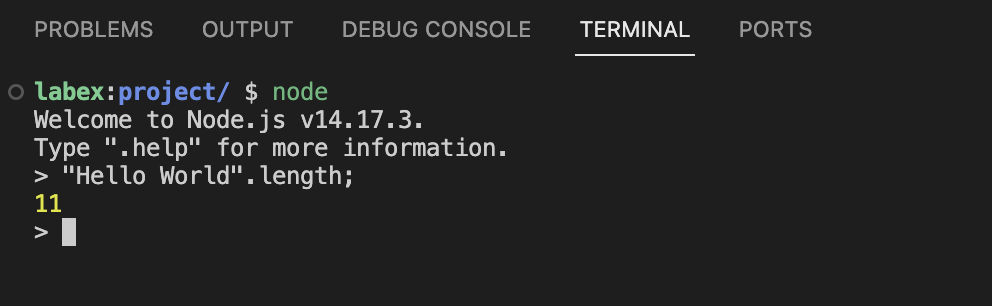

# Comprender la representación de cadenas en JavaScript

Antes de calcular el tamaño en bytes de las cadenas, es importante entender cómo se representan las cadenas en JavaScript.

En JavaScript, las cadenas son secuencias de unidades de código UTF-16. Esto significa que caracteres como emojis o ciertos símbolos pueden ocupar más de un byte para representarse. Por ejemplo, una simple letra inglesa ocupa 1 byte, pero un emoji puede ocupar 4 bytes.

Comencemos lanzando Node.js en la terminal:

1. Abra la Terminal haciendo clic en el icono de la terminal en la interfaz de WebIDE.
2. Escriba el siguiente comando y presione Enter:

```bash
node
```

Ahora debería estar en la consola interactiva de Node.js, que se ve algo así:

```
Welcome to Node.js v14.x.x.
Type ".help" for more information.
>
```



En esta consola, podemos experimentar directamente con código JavaScript. Intente escribir el siguiente comando para ver la longitud de una cadena:

```javascript
"Hello World".length;
```

Debería ver la salida:

```
11
```

Esto nos da la cantidad de caracteres, pero no el tamaño real en bytes. La cantidad de caracteres y el tamaño en bytes pueden ser diferentes, especialmente con caracteres especiales. Exploremos esto más a fondo en el siguiente paso.
